# 1.Basic Part
### 1.1 Introduction 
This experiment aims to investigate **the quantitative relationship between key camera parameters (exposure and gain) and the characteristics of captured image pixels** through practical tests. Additionally, as a bonus objective, it seeks to derive **a quantitative noise model for the captured pixels—including identifying relevant influencing parameters**, formulating the noise equation, and evaluating how effectively the model explains the actual pixel characteristics. The experiment referred to the given code for direct image capture and analysis, with findings documented in a report alongside supporting data and code.
The following is our division of labor:
- 1.1 Introduction,1.2 Experiment Setup :Wang Shengxiang
- 1.3 Result and Data Processing,1.4 Analysis and Discussion ,1.5 Conclusion :Wang Shengxiang and Deng Jiawei
- 2 Bonus part:Wang Wenshuo
### 1.2 Experiment Setup
  Ppreparatory Work
  1. First, use the pylon software to focus the camera
  2. Second, download and compile the provided starter code to learn how to capture picture with code.
  3. Third,we program a python shell `lab1_img_capturer.py` to collect data,and the file is in the code folder.
   
- Data Collection
  1. Design experiments: Keep other camera parameters stable(especially the gain), adjust the exposure parameter across different levels, capture images under each level, and record corresponding pixel data.
  For exposure, we respectively set the gain between 2 and 25 (with a step size of 2) and the exposure between 500 and 25,000 (with a step size of 1000)
  2. Repeat the experiment process for the gain parameter—adjust gain levels while fixing other variables, capture images, and collect pixel information.
  But the exposure is set between 1000 and 25000 (with a step size of 5000) and gain is set between 5 and 25 (with a step size of 1).
      > Here, a double-loop traversal method is set for both parameters because, first, since the experiment is only conducted once a week, we want to obtain sufficient data just in case; Secondly, we want to see if the function graphs fitted under different gain values are parallel when traversing the exposure.

- Analysis Data 
  We guess that when the exposure is fixed, the RGB values of the photo are directly proportional to the gain,and it's the same when we fix the gain.
  We wrote a script to calculate the RGB values of the photos under each group of camera parameters and built simulations to combine them.The result is in the next chapter.

### 1.3 Result and Data Processing
- **Imaging Results**  
This section is based on the images captured in the previous section, with data analysis and visualization performed using Python. The images read by the program are shown below:  
`img_0084_exp9500_gain8_bright1322.png`:
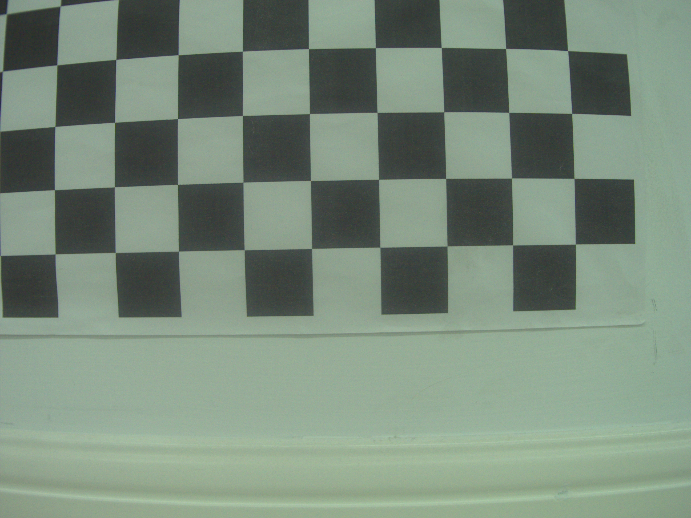
- **Analysis Program**  
The program can be roughly divided into two parts:  

  - **Part 1: Data Collection and Calculation**  
  The `collect_image_data` function collects data from all valid-format images in the specified directory, calculates the average RGB values for each image, and stores all parameters in a list.  

  ```python
  def collect_image_data(directory):
      # 从指定目录中所有格式正确的图像中收集数据
      data = []
      # 遍历目录中的所有文件
      for filename in os.listdir(directory):
          if filename.endswith('.png'):
              # 解析文件名
              params = parse_filename(filename)
              if params:
                  a, exposure, gain, brightness = params
                  # 获取完整图像路径
                  image_path = os.path.join(directory, filename)
                  # 获取平均RGB值
                  rgb = get_average_rgb(image_path)
                  if rgb:
                      r, g, b = rgb
                      data.append({
                          'a': a,
                          'exposure': exposure,
                          'gain': gain,
                          'brightness': brightness,
                          'r': r,
                          'g': g,
                          'b': b
                      })
                      print(f"Processed: {filename}")
      return data
  ```  

  Among these, the `parse_filename` function is used to extract parameters from filenames, and the `get_average_rgb` function is used to calculate the average RGB values of an image.  


  - **Part 2: Plot Generation**  
  The `plot_rgb_vs_exposure_and_gain` function processes the data from the above function and generates plots showing how RGB values change with exposure and gain.  

  ```python
  def plot_rgb_vs_exposure_and_gain(data):
      # 主绘图函数
      if not data:
          print("No data available for plotting")
          return
      
      # 保存3D图
      fig3d = plot_3d_figures(data)
      fig3d.savefig('rgb_3d_analysis.png', dpi=300, bbox_inches='tight')
      
      # 保存2D图和方程汇总图
      fig2d, fig_eq = plot_2d_figures(data)
      fig2d.savefig('rgb_2d_dual_analysis.png', dpi=300, bbox_inches='tight')
      fig_eq.savefig('rgb_fitting_equations_dual.png', dpi=300, bbox_inches='tight')
      
      print("Analysis results saved as:")
      print("- 'rgb_3d_analysis.png' (3D Relationship Plot)")
      print("- 'rgb_2d_dual_analysis.png' (2D Dual-Variable Analysis Plot)")
      print("- 'rgb_fitting_equations_dual.png' (Fitting Equations Summary)")
      plt.show()
  ```  

  Here, the `plot_3d_figures` function is used to generate 3D plots, while the `plot_2d_figures` function is used to generate 2D plots and images of the fitted equations. In `plot_2d_figures`, we observed that RGB values tend to saturate; fitting them with a single straight line would lead to significant deviations from the actual situation. Therefore, we adopted a segmented fitting method: by consulting Doubao AI, we had it modify our single-segment fitting function. The resulting two-segment fitting function can better illustrate the trend of RGB values changing with exposure and gain. Additionally, when writing the fitting function, we also consulted AI to find suitable libraries and functions, which facilitated our programming.  


- **Processing Results** 
1. The 3D plot of RGB values varying with gain and exposure is as follows:
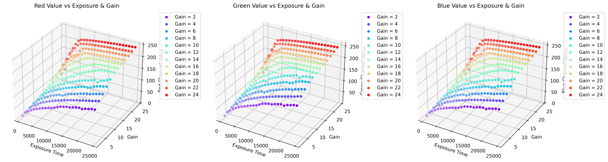

2. The 2D fitting plots of RGB values varying with gain and exposure respectively are as follows:
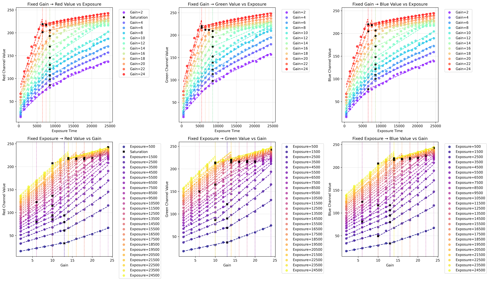

3. The fitting equations are as follows: 
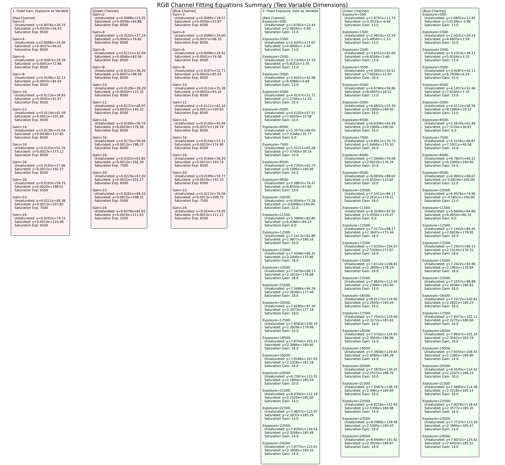

- **Other Conjecture**
1. We suspect that there is still a double-line relationship between them(RGB = k1*gain + k2*exposure + b), and thus made the following fitting.The code is in `double-line relationship.py`.
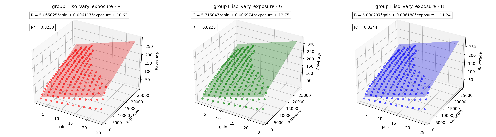
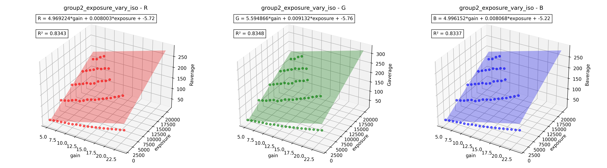

2. We guess RGB has a linear relationship with their product(RGB = k*(gain×exposure) + b).The code is in `product_liner.py`.
  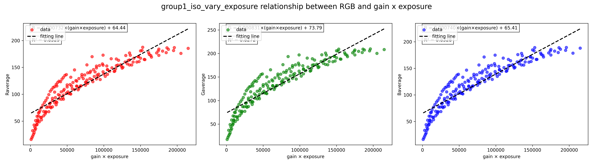
  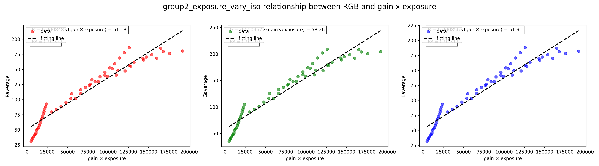
### 1.4 Analysis and Discussion 
#### 1.4.1 Scope of Application for Linear Relationship: The Unsaturated Stage Is Key  
First, it is important to clarify that the linear relationship between RGB values and gain/exposure does not hold in all cases. Its core applicable scenario is the **stage where parameters do not cause RGB values to saturate**—that is, when the image brightness has not "reached the upper limit". Once gain or exposure becomes too large and RGB values enter a saturated state, this linear relationship is broken, which serves as a crucial premise for the subsequent analysis.  


#### 1.4.2 Manifestation of Linear Relationship Observed from Charts  
From `rgb_3d_analysis.png` (the 3D plot), it can be seen that when gain and exposure are at low levels (e.g., gain ranging from 2 to 8 and exposure ranging from 500 to 10,000), the RGB values of the three channels show obvious proportionality with the increase of the two parameters. For example, if exposure is increased from 1,000 to 2,000 (doubled) while keeping gain = 4 constant, RGB values will increase from approximately 80 to 160 (nearly doubled); if exposure is fixed at 5,000 and gain is increased from 2 to 4 (doubled), RGB values will also increase from approximately 60 to 120 (nearly doubled). This characteristic of "RGB values changing in proportion to parameter changes" is a typical manifestation of a linear relationship.  

The linear relationship is even more intuitive in `rgb_2d_dual_analysis.png` (the 2D plot). Taking the upper row ("fixed gain, analyzing the impact of exposure on RGB values") as an example: when gain is fixed at 2, RGB values show a linear upward trend as exposure increases within the range of 500 to 15,000—for every 1,000 increase in exposure, RGB values stably increase by approximately 12 to 15. When gain is fixed at 4, for every 1,000 increase in exposure, RGB values stably increase by approximately 25 to 28. The growth amplitude always maintains a fixed ratio with the variation amplitude of exposure, with no significant fluctuations.  

A similar pattern is observed in the lower row ("fixed exposure, analyzing the impact of gain on RGB values"): when exposure is fixed at 5,000, gain within the range of 2 to 6 leads to an average increase of approximately 20 to 22 in RGB values for every 1 increase in gain; when exposure is fixed at 10,000, every 1 increase in gain results in an average increase of approximately 23 to 25 in RGB values. This also conforms to the linear characteristic of "parameter changes being proportional to RGB value changes".  


#### 1.4.3 Necessity of Segmented Fitting: Saturation Breaks the Linear Relationship  
It can also be observed from the charts that when parameters exceed a certain threshold (e.g., exposure > 20,000 or gain > 10), the growth of RGB values slows down abruptly and tends to stabilize, entering a "saturated state". This is because the pixels of the camera sensor have a physical limit—each pixel can only store a fixed amount of charge. When the accumulated optical signal exceeds this limit, the excess signal cannot be effectively recorded, so RGB values no longer increase with parameter changes, and the linear relationship naturally fails.  

Therefore, the fitting equations (in `rgb_fitting_equations_dual.png`) adopt a segmented strategy: the unsaturated stage uses a linear formula (e.g., for the red channel in the unsaturated stage: y = 0.024x + 12.36, where x represents exposure) to directly describe the proportional relationship between parameters and RGB values; the saturated stage uses a gentle formula with a slope close to 0 (e.g., for the red channel in the saturated stage: y = 0.003x + 241.58) to correct the deviation of a single linear model. This approach not only preserves the linear characteristics of the unsaturated stage but also accurately reflects the actual changes after saturation, resulting in more reliable fitting results.  


#### 1.4.4 More complex relationships
- **Double-line relationship**
We suspect that there is  a double-line relationship between them
$RGB = k1*gain + k2*exposure + b$ 
Then we excluded some saturated points and fitted them.We conducted fitting on two groups of pictures(in section 1.3,Other Conjecture) and obtained the following results:
fitting result:
**group1_iso_vary_exposure**
R: R = 5.065025*gain + 0.006117*exposure + 10.62
  R² = 0.8250
G: G = 5.715047*gain + 0.006974*exposure + 12.75
  R² = 0.8228
B: B = 5.090297*gain + 0.006188*exposure + 11.24
  R² = 0.8244
**group2_exposure_vary_iso**
R: R = 4.969224*gain + 0.008003*exposure + -5.72
  R² = 0.8343
G: G = 5.594866*gain + 0.009132*exposure + -5.76
  R² = 0.8348
B: B = 4.996152*gain + 0.008068*exposure + -5.22
  R² = 0.8337
**It can be seen that in the fitting results of the two groups of pictures, the errors of the coefficients k1 and k2 are very small**.

- **Linear relationship with their product**
$(RGB = k*(gain×exposure) + b)$
We also excluded some saturated points and fitted them.We conducted fitting on two groups of pictures and obtained the following results:
**group1_iso_vary_exposure**
R: R = 0.000732×(gain×exposure) + 64.44
 R² = 0.8329
G: G = 0.000831×(gain×exposure) + 73.79
 R² = 0.8272
B: B = 0.000740×(gain×exposure) + 65.41
 R² = 0.8328
**group2_exposure_vary_iso**
R: R = 0.000848×(gain×exposure) + 51.13
 R² = 0.9232
G: G = 0.000967×(gain×exposure) + 58.26
 R² = 0.9229
B: B = 0.000856×(gain×exposure) + 51.91
 R² = 0.9231
It can be seen that the fitting effect of this kind is poor because the RGB value error is too large under low exposure and low gain conditions.Therefore, we adopted a bilinear model in the summary.
### 1.5 Conclusion  

1. **In the unsaturated stage, RGB values roughly satisfy a linear relationship with gain and exposure**  
Within the range where gain (G) and exposure (E) do not cause RGB values to saturate, the RGB values of the red, green, and blue channels all change proportionally with the increase of the two parameters. When parameters are doubled, RGB values nearly double; when parameters increase by a fixed amplitude, RGB values also increase by a fixed amplitude. This linear relationship is stable in the low to medium parameter range and can serve as an important reference for adjusting camera parameters.  


2. **Saturation is the boundary of the linear relationship, and there are differences among channels**  
Once gain or exposure becomes too large and causes RGB values to saturate, the linear relationship fails, and RGB values no longer increase significantly with parameter changes. Among the three channels, the blue channel saturates most easily, while the green channel is the most resistant to saturation. However, regardless of the channel, the linear relationship holds as long as the saturation threshold is not reached, which provides a clear "safe range" for parameter adjustment.  
**In our experiment, it can be seen that when the gain reaches 14 and the exposure time reaches 5000, the image is basically saturated.**

3. **General formula for RGB values with gain and exposure in double-line relationship**  
Based on experimental fitting results, the relationship between RGB values (denoted as \( RGB_{ch} \), where \( ch = R, G, B \) represents red, green, and blue channels respectively) and gain (G)、exposure (E) can be described by a **two-segment piecewise function** (parameters in the formula are obtained by fitting actual data, and values vary slightly with channels):  

\[
RGB_{ch} = 
\begin{cases} 
k_{ch,G} \cdot G + k_{ch,E} \cdot E + B_{ch} & \text{if } k_{ch,G} \cdot G + k_{ch,E} \cdot E + B_{ch} < T_{ch} \\
S_{ch} & \text{if } k_{ch,G} \cdot G + k_{ch,E} \cdot E + B_{ch} \geq T_{ch}
\end{cases}
\]  

- Symbols and meanings:  
  - \( k_{ch,G} \): Gain coefficient of channel \( ch \) (reflects the sensitivity of RGB values to gain changes, e.g., \( k_{R,G} \approx 5.02 \), \( k_{G,G} \approx 5.66 \), \( k_{B,G} \approx 5.05 \) in this experiment);  

  - \( k_{ch,E} \): Exposure coefficient of channel \( ch \) (reflects the sensitivity of RGB values to exposure changes, e.g., \( k_{R,E} \approx 0.007 \), \( k_{G,E} \approx 0.008 \), \( k_{B,E} \approx 0.0072 \) in this experiment);  
  - \( B_{ch} \): Base RGB value of channel \( ch \) (minimum RGB value when gain=0 and exposure=0, mainly caused by sensor dark current, e.g., \( B_{R} \approx 2.45 \), \( B_{G} \approx 3.47 \), \( B_{B} \approx 3.1 \) in this experiment);  
  - \( T_{ch} \): Saturation threshold of channel \( ch \) (maximum RGB value before saturation, e.g., \( T_{R} \approx 240 \), \( T_{G} \approx 245 \), \( T_{B} \approx 235 \) in this experiment);  
  - \( S_{ch} \): Saturated RGB value of channel \( ch \) (stable RGB value after saturation, close to the maximum gray level of 8-bit images, e.g., \( S_{R} \approx 245 \), \( S_{G} \approx 250 \), \( S_{B} \approx 240 \) in this experiment).  

4. **The linear relationship can be used to simplify parameter adjustment**  
In practical operation, parameters can be adjusted based on the linear relationship and general formula: if the image is too dark (low RGB values), exposure or gain can be increased proportionally within the unsaturated range (e.g., increasing exposure from 1,000 to 2,000 or gain from 2 to 4) without blind attempts. By substituting expected RGB values into the linear segment of the general formula, the required gain and exposure combinations can even be roughly calculated. At the same time, avoiding parameters exceeding the saturation threshold (\( T_{ch} \)) can not only ensure appropriate image brightness but also reduce issues such as color cast and noise.  


In summary, the two-segment general formula accurately describes the relationship between RGB values and gain/exposure, with the linear segment reflecting proportional changes and the saturated segment reflecting the physical limit of the sensor. Mastering this formula and its applicable conditions can help control image brightness more efficiently and accurately in practical operations.


# 2.Bonus Part
## 2.1 Confirmation of the Noise Type
To start with, we selected a picture to analyze, the picture and the choosed area is shown below:
|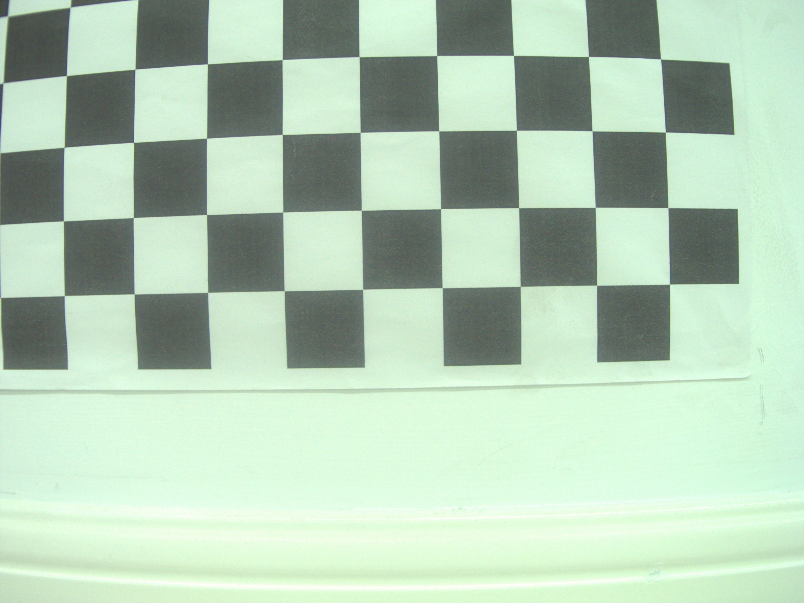|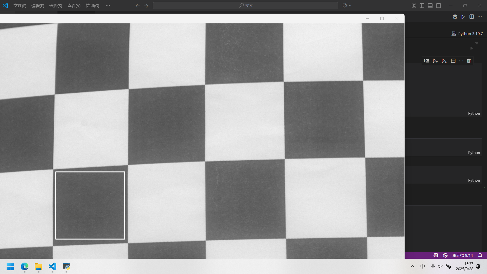|
|:-------------------------:|:-------------------------:|
|The original picture|The selected area (within the light gray box)|

And the pixel distribution histogram is as follows:
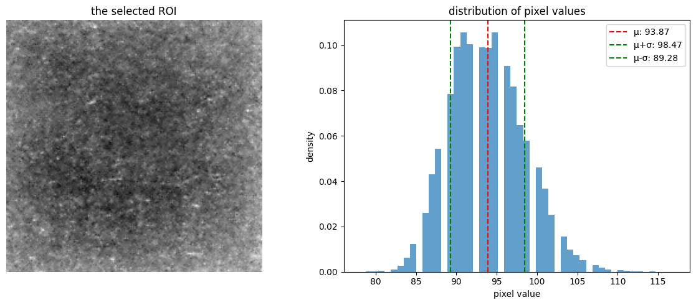
It can be seen that the noise distribution presents a bell-shaped curve, which is inferred to be Gaussian noise.

Furthermore, we selected 9 images, plotted the pixel distribution histograms of the same region, and observed that the noise probabilities all exhibited a bell-shaped distribution. Thus, it can be basically confirmed that the main noise in the images is Gaussian noise.
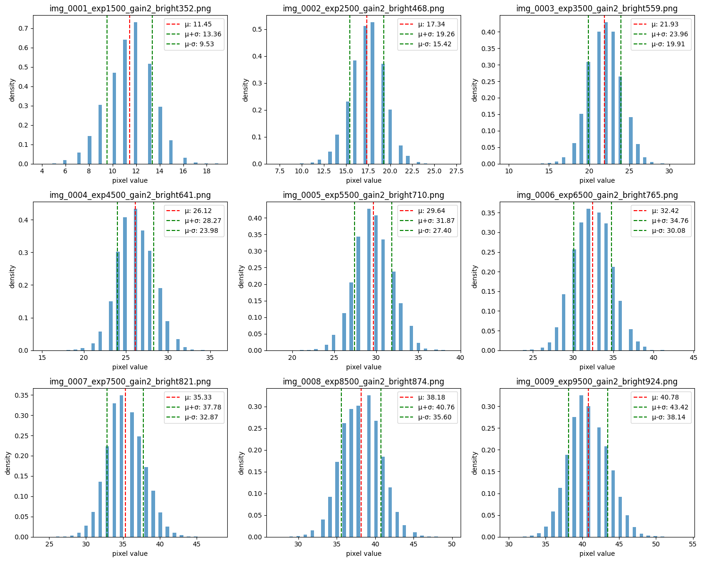

**Conclusion 1**: The noise distribution of the images is **Gaussian noise**.

## 2.2 Finding Influencing Parameters
We have tooken 400 images with different exposure and gain parameters, which name format is *`img_XXXX_expXXXX_gainX_brightXXX.png`*. The exposure varies from **500** to **24500**, and the gain varies from **2** to **24**.
For each image, we have calculated the mean, standard deviation and variance of the pixel values in the same selected area, and then we can get the following figure:
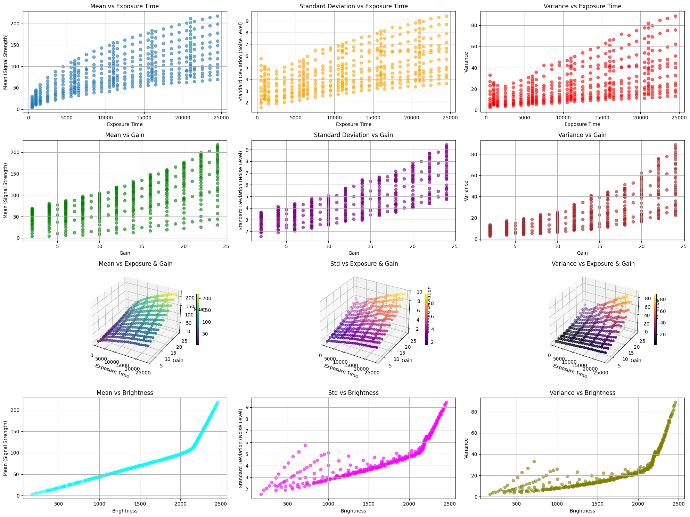

From the figure, we can easily see that the noise parameters are **exposure** and **gain**, and how they affect the noise directly.

**Conclusion 2**: The influence parameters of the noise are **exposure** and **gain**.**As the gain increases, the mean and standard deviation (variance) increase, with the rate being slow first and then fast. As the exposure increases, the mean value increases, and the rate is fast first and then slow; the standard deviation increases approximately linearly with the increase of exposure, while the variance increases in a squared trend as the exposure increases.**

## 2.3 Noise Model
### 2.3.1 The Quantitative Relationship of the Mean
#### 2.3.1.1 Mean vs. Exposure
For each value of exposure, we have calculated the average of the mean of the pixels in the same selected area, and here is the figure:
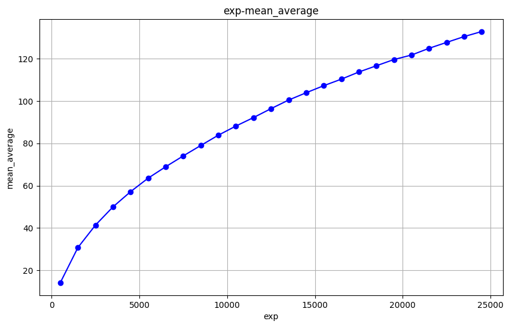

|exposure|500|1500|2500|3500|4500|5500|6500|7500|8500|
|:---:|:---:|:---:|:---:|:---:|:---:|:---:|:---:|:---:|:---:|
|mean|14.27|30.8|41.38|49.99|57.15|63.53|68.91|74.02|78.95|
|exposure|9500|10500|11500|12500|13500|14500|15500|16500|17500|
|mean|83.8|88.11|92.1|96.32|100.36|103.81|107.14|110.21|113.59|
|exposure|18500|19500|20500|21500|22500|23500|24500|
|mean|116.54|119.48|121.6|124.78|127.56|130.31|132.69|

Suppose **mean = a * exp(bx) + c**, where a, b and c are constants.
a = -137.5776
b = -0.0718
c = 153.8031

mean = -137.5776 * exp(-0.0718 * exposure) + 153.8031

#### 2.3.1.2 Mean vs. Gain
For each value of gain, we have calculated the average of the mean of the pixels in the same selected area, and here is the figure:


|gain|5|6|7|8|9|10|11|12|13|14|
|:---:|:---:|:---:|:---:|:---:|:---:|:---:|:---:|:---:|:---:|:---:|
|mean|49.21|52.11|56.33|59.84|64.18|65.33|69.22|74.93|79.36|82.54|
|gain|15|16|17|18|19|20|21|22|23|24|
|mean|88.28|93.66|98.68|103.45|109.91|116.0|121.78|129.0|135.24|141.54|

Suppose **mean = a * gain^2 + b * gain + c**, where a, b and c are constants.
a = 0.1107
b = 1.6322
c = 38.9045
mean = 0.1107 * gain^2 + 1.6322 * gain + 38.9045

#### 2.3.1.3 Mean vs. Exposure and Gain
Suppose **mean = k * (-137.5776 * exp(-0.0718 * exposure) + 153.8031) * (0.1107 * gain^2 + 1.6322 * gain + 38.9045)**, where k is a constant.
gain_average = 14.5
exposure_average = 12000
mean_average = 89.73311

k = 0.006796

mean = 0.006796 * (-137.5776 * exp(-0.0718 * exposure) + 153.8031) * (0.1107 * gain^2 + 1.6322 * gain + 38.9045)
     
**mean = 0.10 * (-exp(-0.07 * exposure) + 1.12) * (gain^2 + 14.74 * gain + 351.44)**

### 2.3.2 The Quantitative Relationship of the Standard Deviation
#### 2.3.2.1 Standard Deviation vs. Exposure
Similarly, the exp-std figure:
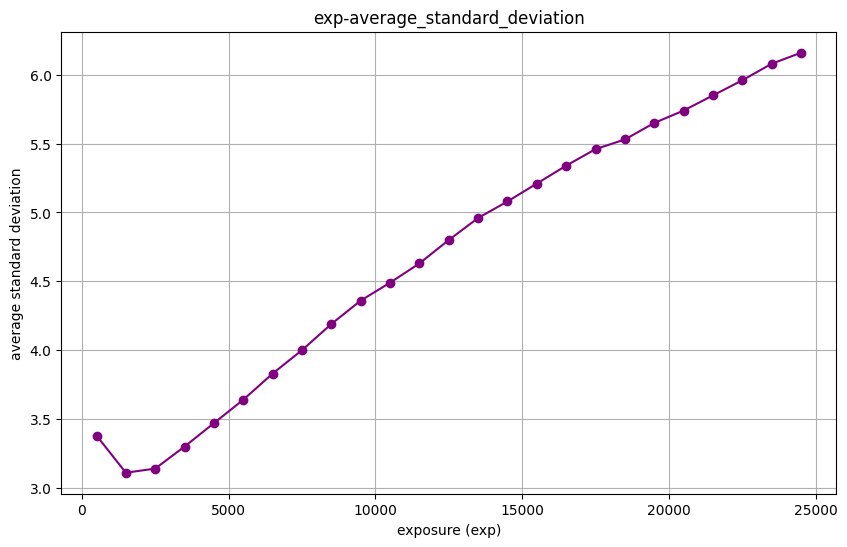

|exposure|500|1500|2500|3500|4500|5500|6500|7500|8500|
|:---:|:---:|:---:|:---:|:---:|:---:|:---:|:---:|:---:|:---:|
|std|3.38|3.11|3.14|3.3|3.47|3.64|3.83|4.0|4.19|
|exposure|9500|10500|11500|12500|13500|14500|15500|16500|17500|
|std|4.36|4.49|4.63|4.8|4.96|5.08|5.21|5.34|5.46|
|exposure|18500|19500|20500|21500|22500|23500|24500|
|std|5.53|5.65|5.74|5.85|5.96|6.08|6.16|

Finally, we get the following equation:
std = 0.000293 * exposure^(0.924971) + 2.914441

#### 2.3.2.2 Standard Deviation vs. Gain
Similarly, the gain-std figure:
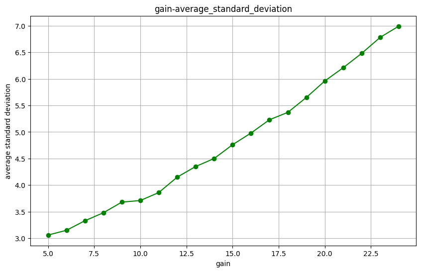

|gain|5|6|7|8|9|10|11|12|13|14|
|:---:|:---:|:---:|:---:|:---:|:---:|:---:|:---:|:---:|:---:|:---:|
|std|3.06|3.15|3.33|3.48|3.68|3.71|3.86|4.15|4.35|4.5|
|gain|15|16|17|18|19|20|21|22|23|24|
|std|4.76|4.98|5.23|5.37|5.65|5.96|6.21|6.48|6.78|6.99|

Finally, we get the following equation:
std = 0.02574 * gain^(1.611629) + 2.717018

#### 2.3.2.3 Standard Deviation vs. Exposure and Gain
Similar to 2.3.1.3, we get the following equation:
std = 0.219666416 * (0.000293 * exposure^(0.924971) + 2.914441) * (0.02574 * gain^(1.611629) + 2.717018)

**std = 1.66e-6 * (exposure^0.92 + 9946.90) * (gain^1.61 + 105.56)**

**Conclusion 3**: The noise model is **Gaussian noise**, and the noise parameters are **exposure** and **gain**. The equation of the noise model is as follows:

Gaussian noise model:
\[
p = \frac{1}{\sqrt{2\pi\sigma}} e^{-\left(\frac{(x-\mu)^2}{2\sigma^2}\right)}
\]

In which,
\[
\mu = 0.10\left(-e^{-0.07 \cdot \text{exposure}} + 1.12\right)\left(\text{gain}^2 + 14.74 \cdot \text{gain} + 351.44\right)
\]

And
\[
\sigma = 1.66 \times 10^{-6} \left(\text{exposure}^{0.92} + 9946.90\right)\left(\text{gain}^{1.61} + 105.56\right)
\]

For the median images, the fitting degree of the model is up to **94.82%**.

## 3.Declaration
Our work used AI assistance. Here are the AI assistance used in our work:
1. For some theories, including but not limited to image noise, the least squares method, and plt plotting syntax, AI was used to explain the principles, provide examples, or correct misunderstandings.
2. Code Completion. During this assignment, AI(Tongyi Lingma) has been used to complete the code, for most of the code are similar. For example, in the function `Noise_Analysis.ipynb/process_images_and_plot(folder_path)`, the code for the first graph is completed by human, while the others are completed by AI and then modified by human. Also, the code for the first version of the fitting curve (in section 2.3.1.1 Mean vs. Exposure) was written manually, while the subsequent code for data modification and curve fitting was completed through AI-based revisions and manual review.
3. This report, especially some similar parts, was completed by AI. For example, section 2.3.1.1, 2.3.1.2, 2.3.2.1, 2.3.2.2 have the same structure, and some parts of them are completed by AI. Also, a few of the statements are translated into English by AI.
4. **No code was directly copied from the Artificial Intelligence.**
