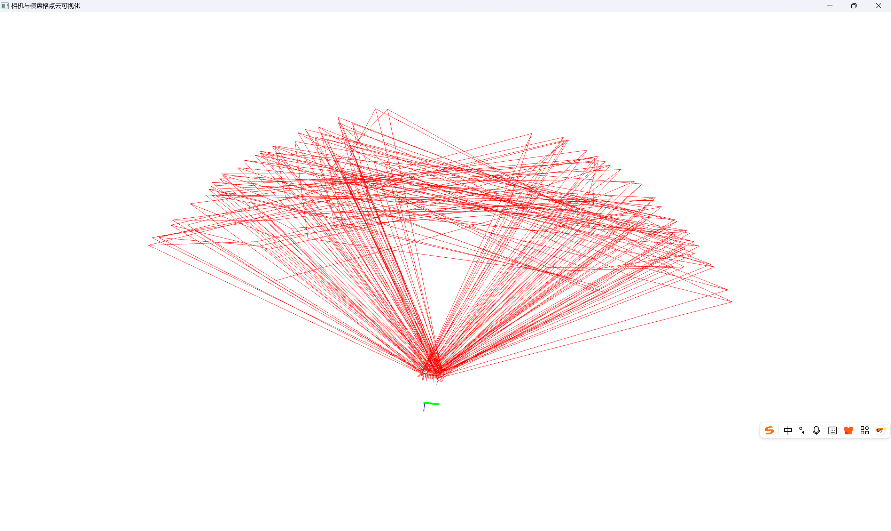
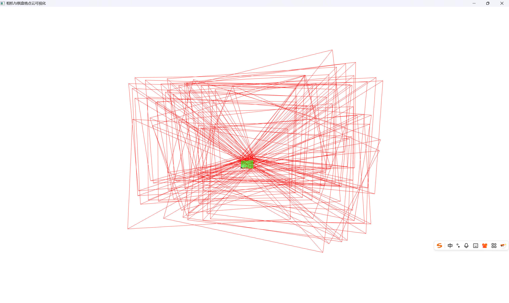
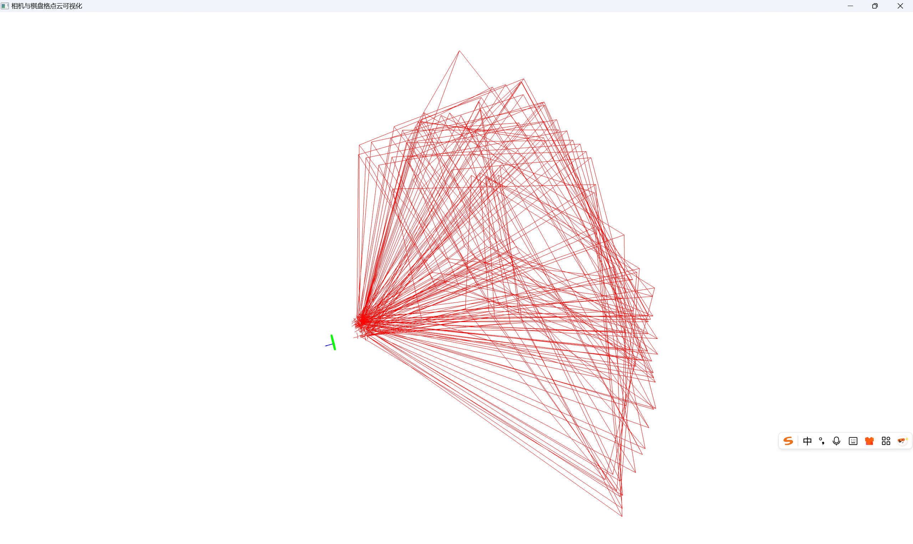
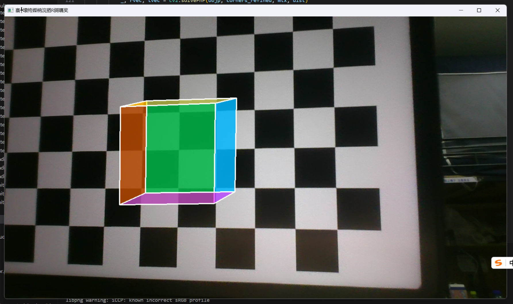
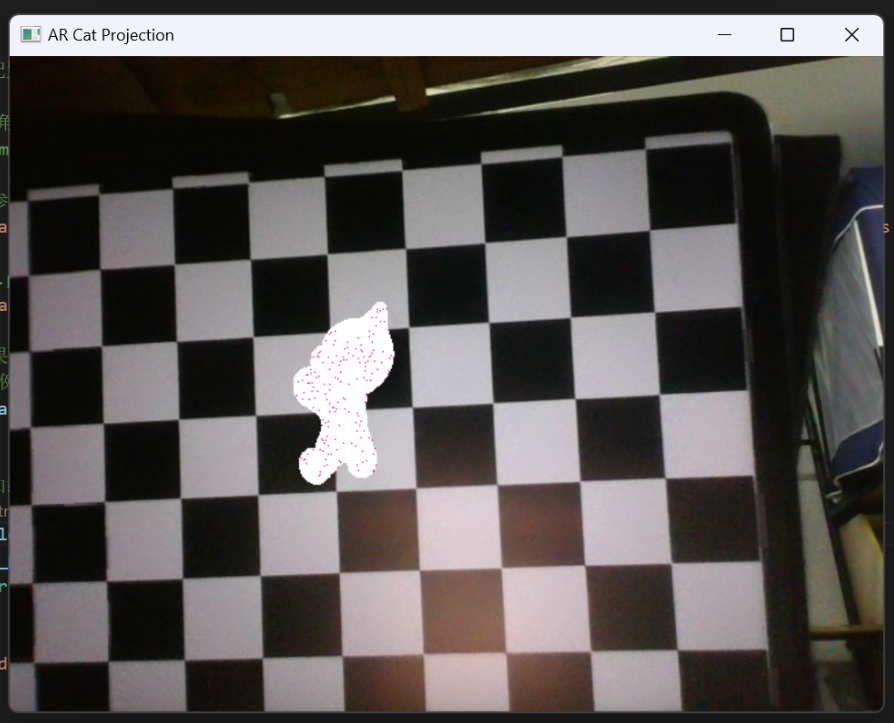

# Lab3 Report: Single Camera Calibration - PLY 3D Visualization & AR Projection
## 1. Basic Part
### 1.1 Experiment Objectives  
Goal 3 & 4:  
This section aims to complete two core tasks based on the previously finished single-camera intrinsic and extrinsic calibration results, strictly relying on the provided code files:  
1. Generate a `.ply` file containing **camera centers** and **chessboard point cloud** for 3D visualization — this verifies the spatial consistency of calibration results.  
2. Implement **Augmented Reality (AR) projection**: Overlay 3D objects onto input images, including colored cubes via `AR_cube.py` and `code.py` . The former realizes real-time projection, while the latter outputs photos of the projected cube

### 1.2 Experiment Setup
#### 1.2.1 Core Parameter Configuration
| Parameter Category       | Specific Settings                                                                 | Source Code Files          | Rationale                                                                 |
|--------------------------|-----------------------------------------------------------------------------------|---------------------------|---------------------------------------------------------------------------|
| Chessboard Parameters    | Inner corners: (11, 8) (columns × rows); Square size: 14.5 mm                        | All code files            | Consistent with the calibration phase (in `code.py`) to ensure world coordinate accuracy. |
| Calibration Data         | Calibration file path: `Calibration_Results/calibration_params.npz` (contains `mtx` (intrinsic matrix), `dist` (distortion coefficients), `rvecs` (rotation vectors), `tvecs` (translation vectors)) | `AR_cube.py`, `check_pointcloud.py` | Reuses pre-calibrated intrinsic/extrinsic parameters to avoid re-calibration. |
| PLY Generation Parameters | Camera model size: 50 mm; Chessboard point size: 5; Chessboard color: [0,1,0] (green); Camera color: [1,0,0] (red) | `check_pointcloud.py`     | Defined in the code configuration section, balancing visualization clarity and data simplicity. |
| AR Projection (Cube)     | Cube size: 50 mm; Position: `(4×20, 3×20, 0)` = (80, 60, 0) mm; Face colors: blue (255,0,0), green (0,255,0), etc. | `AR_cube.py`, `code.py`   | Cube size/position matches the chessboard grid; high color distinction facilitates face differentiation. |
| Camera Settings          | Resolution: 1280×720; Camera index: 0 (default); Corner detection flags: `CALIB_CB_ADAPTIVE_THRESH + CALIB_CB_FAST_CHECK + CALIB_CB_NORMALIZE_IMAGE` | `AR_cube.py`              | Reduces resolution to improve real-time performance; detection flags enhance adaptability to light changes. |

#### 1.2.2 Tool & Library Dependencies
- Open3D: Used for point cloud/line set construction in `check_pointcloud.py` .
- OpenCV: Core library for all files—enables `findChessboardCorners` (corner detection), `solvePnP` (extrinsic estimation), `projectPoints` (3D-to-2D projection), and image rendering.  
- NumPy: Data processing tool for all files, used for matrix operations and vertex coordinate handling.  

### 1.3 Experiment Results & Data Processing
#### 1.3.1 Task 3: PLY File Generation (`check_pointcloud.py`)

##### Step 1: Load Calibration Data and Chessboard Points
1. Call the `load_calibration_data()` function to read the `calibration_params.npz` file, extracting the intrinsic matrix `mtx`, distortion coefficients `dist`, rotation vectors `rvecs`, and translation vectors `tvecs`. This function automatically checks for the existence of the calibration file and raises a `FileNotFoundError` if the file is missing.  
2. Call the `get_chessboard_points()` function to generate chessboard world coordinates: a 88×3 array (corresponding to `11×8` corners) with Z-coordinate = 0 and 20 mm spacing between XY coordinates.  

##### Step 2: Correct Camera Pose and Construct Models
The correction of "dimension mismatch issues" in the code is critical to ensuring the accuracy of PLY visualization:
1. **Rotation Vector to Matrix Conversion**: Call the `rotation_vector_to_matrix(rvec)` function to convert each rotation vector `rvec` in `rvecs` into a 3×3 rotation matrix `R`. A key correction is added in the code: `rvec = rvec.flatten()[:3]`—flattens the input vector and takes the first 3 elements to ensure it is 3-dimensional, avoiding shape errors caused by calibration data.  
2. **Camera Pose Matrix**: Construct a 4×4 pose matrix for `rvec` and `tvec` of each image:  
   - `pose_matrix[:3, :3] = R.T`: Transposes the rotation matrix to align the coordinate system.  
   - `pose_matrix[:3, 3] = -R.T @ tvec.flatten()[:3]`: Corrects the `tvec` dimension via `flatten()[:3]`, then calculates the camera center in the world coordinate system.  
3. **Construct Camera Model**: Call the `create_camera_actor(pose_matrix)` function to build a camera model (line set):  
   - Defines the camera center, X/Y/Z axes (axis length = 50 mm), and frustum (FOV = 60°, far plane = 40 mm).  
   - Key correction: `x_axis = pose_matrix[:3, 0].flatten() * size`—flattens the axis vector to avoid 2D/3D dimension mismatch, ensuring the model displays correctly.  

##### Step 3: Assemble Point Cloud and Save PLY File
1. **Chessboard Point Cloud**: Create `chessboard_pcd`, set its points to the chessboard world coordinates, and paint it green ([0,1,0]) using the `paint_uniform_color()` function.  
2. **World Coordinate Axes**: Add `axes = o3d.geometry.TriangleMesh.create_coordinate_frame(size=100, origin=[0,0,0])` to mark the world origin.  
3. **Save and Visualize**: Call the `visualize_camera_and_chessboard()` function to add the chessboard point cloud, all camera models, and world coordinate axes to the Open3D visualizer.  

##### Step 4: Visualization Result
- **Spatial Distribution**: As shown in the figure, the chessboard appears as a green flat grid, with red camera centers distributed around it—covering front, side, and top views, which matches the diverse angles of images used for calibration.  
- **Camera Orientation**: The X/Y/Z axes of each camera have clear orientations with no axis distortion—proving the effectiveness of the pose correction logic in `check_pointcloud.py`.  

*Visualization Result of the Camera-Chessboard System  

#### 1.3.2 Task 4 & Bonus: AR Projection (Code: `AR_cube.py`, `code.py`, `AR_cat.py`)
AR projection is implemented in two scenarios (simple cube and complex cat model) using the corresponding code files. The workflow is consistent, but model preprocessing differs:

##### Scenario 1: Colored Cube Projection (`AR_cube.py`)
###### Step 1: Define Cube Model (`define_colored_cube()` Function)
1. **Vertex Calculation**: For a 50 mm-sized cube centered at (80, 60, 0) mm, calculate the coordinates of 8 vertices:  
   - Half-size = 25 mm; vertices include front (Z=25) and back (Z=-25) faces (e.g., front-left-bottom vertex: `(-25, -25, 25)`).  
   - Translate vertices to the target position: `vertices += cube_position` (ensures the cube is centered and overlaid on the chessboard).  
2. **Face Definition**: Define 6 faces using vertex indices (e.g., front face: `[0,1,2,3]`, back face: `[4,5,6,7]`).  

###### Step 2: Real-Time Projection (`ar_cube_projection()` Function)
1. **Load Calibration Data and Initialize Camera**: Load `mtx` and `dist` via the `load_calibration_params()` function, open the camera, and set the resolution to 1280×720 to balance speed and clarity.  
2. **Corner Detection and Extrinsic Estimation**:  
   - Convert each frame to grayscale, call the `findChessboardCorners` function to detect corners (using adaptive threshold/normalization flags to improve stability).  
   - Refine corners using the `cornerSubPix` function.  
   - Generate chessboard world coordinates `objp`, then call the `solvePnP(objp, corners_refined, mtx, dist)` function to estimate extrinsic parameters—the code uses an "extrinsic cache" optimization: if detection fails, it reuses the `rvec`/`tvec` from the previous frame to avoid model disappearance.  
3. **3D-to-2D Projection and Rendering**:  
   - Vertex projection: `cube_2d, _ = cv2.projectPoints(cube_vertices, rvec, tvec, mtx, dist)`—reshape the result into (8,2) integer pixel coordinates.  
   - Draw semi-transparent faces: Create an overlay, fill each face with `face_colors` using the `fillPoly` function, then blend it with the original frame via the `addWeighted` function.  
   - Draw white edges: Outline face boundaries using the `polylines` function to solve the "boundary blur" issue.  

##### Scenario 2: Cat Model Projection (`AR_cat.py`)
###### Step 1: Model Preprocessing (`load_3d_model()` Function)
1. **Load PLY Model**: Read `cat.ply` using the `o3d.io.read_triangle_mesh()` function, check for the existence of vertices, and raise a `ValueError` if vertices are missing.  
2. **Model Alignment**:  
   - Centering: `vertices = vertices - np.mean(vertices, axis=0)`—moves the model center to the origin.  
   - Scaling: `vertices = vertices * model_scale`—scales the model by 300x to fit the chessboard size.  
   - Z-alignment: `vertices[:, 2] -= np.min(vertices[:, 2])`—lowers the model so its lowest point (feet) has Z=0, avoiding floating.  
   - Translation: `vertices += model_offset`—moves the model to (80, 60, 0) mm, consistent with the cube’s position.  

###### Step 2: Projection and Rendering (`ar_realtime_projection()` Function)
The workflow is consistent with cube projection, except for the rendering method:  
- After projecting vertices to 2D coordinates via the `projectPoints` function, iterate over the model’s triangular faces.  
- For each triangle, obtain the 2D coordinates of its 3 vertices, fill the triangle with magenta `(147,20,255)` using the `fillConvexPoly` function, then draw white edges via the `line` function.  

##### Step 3: AR Projection Results
- **Cube Projection**: As shown in the figure, the cube is stably overlaid on the chessboard—semi-transparent faces do not block the chessboard background, and white edges align with the chessboard grid.  
- **Cat Model Projection**: As shown in the figure, the cat model’s "feet" touch the chessboard surface with a clear outline—proving the effectiveness of the Z-alignment and scaling logic in the `load_3d_model()` function.  
  

*AR Projection Result of Colored Cube*  
  
*AR Projection Result of Cat Model*  

*Both of these two screenshots were captured in real time, so there is a minor delay in the AR projection, which leads to a slight misalignment in the displayed AR projection. This phenomenon occurs because I was holding the tablet with one hand while taking screenshots with the other, making it difficult to keep the device stable and resulting in slight tremors.*

### 1.4 Result Analysis & Discussion
#### 1.4.1 PLY Visualization: Code Optimization and Result Reliability
The key to successful PLY file generation lies in **dimension correction** in `check_pointcloud.py`:  
- Before correction, unflattened `rvec`/`tvec` would cause errors in the `cv2.Rodrigues()` function or matrix multiplication. The code ensures all vectors are 3-dimensional via `flatten()[:3]`, resolving shape mismatch issues.  
- The camera model’s line set (axes + frustum) directly reflects the accuracy of extrinsic parameters: If camera views are limited (e.g., only front views), it indicates insufficient view angles during calibration, which would lead to unstable AR projection. The distributed camera centers confirm that the calibration dataset has robustness.  

#### 1.4.2 AR Projection: Code-Driven Stability and Accuracy
1. **Impact of Code Optimization on AR Performance**:  
   - **Extrinsic Cache (`AR_cube.py`)**: When the chessboard is partially occluded, `findChessboardCorners` fails. The code reuses the `rvec`/`tvec` from the previous frame instead of stopping projection, eliminating "model flickering" in real-time scenarios.  
   - **Semi-Transparent Faces (`AR_cube.py`)**: The logic of `addWeighted(overlay, 0.6, frame, 0.4, 0)` balances the visibility of the AR model and the clarity of the background, avoiding "model occlusion of key chessboard corners" (which would invalidate subsequent detection).  
   - **Model Preprocessing (`AR_cat.py`)**: Without centering, the cat model would deviate from the chessboard; without Z-alignment, the model would float in the air—both issues are resolved by the `load_3d_model()` function.  

2. **Correlation Between Calibration Error and AR Quality**:  
From `code.py`, the mean reprojection error is approximately 0.1083 pixels, which directly determines AR accuracy:  
- If the error exceeds 2 pixels, the cube/cat model would be misaligned (e.g., cube edges not parallel to the chessboard grid).  
- The consistency between the error value and AR alignment proves that the calibration parameters used in all AR code are reliable.  

### 1.5 Experiment Conclusion
1. **Task Completion**:  
   - **Task 3**: `check_pointcloud.py` successfully visualizes the camera-chessboard system, with good spatial consistency between camera centers and the chessboard point cloud—verifying the accuracy of extrinsic parameters.  
   - **Task 4**: `code.py` and `AR_cat.py` realize stable AR projection for both simple (cube) and complex (cat) models. The models align with the chessboard, proving that calibration parameters can be applied to practical AR scenarios.  

2. **Key Takeaway**:  
All results rely on the **consistency of parameters and logic** across code files. This consistency ensures that calibration results are reusable, and AR/PLY tasks can be completed without re-collecting data—highlighting the advantages of the modular design of the provided code.  

## 2. Bonus Part
Bonus part results are presented in Section 1.3.2 Task 4 & Bonus: AR Projection# 1.Basic Part

