# Lab3 Report: Single Camera Calibration - PLY 3D Visualization & AR Projection
## 1. Basic Part
### 1.1 Experiment Objectives  
Goal 1 & 2:
This section aims to get the camera calibration results for 3D visualization, and discuss the impact of different factors. 

1. Finish intrinsic and extrinsic calibration.
2. Discuss **the impact of different factors** (e.g., # of images, coverage of the chessboard, view angle, etc) over the final reprojection error.

Goal 3 & 4:  
This section aims to complete two core tasks based on the previously finished single-camera intrinsic and extrinsic calibration results, strictly relying on the provided code files:  

3. Generate a `.ply` file containing **camera centers** and **chessboard point cloud** for 3D visualization — this verifies the spatial consistency of calibration results.  
4. Implement **Augmented Reality (AR) projection**: Overlay 3D objects onto input images, including colored cubes via `AR_cube.py` and `code.py` . The former realizes real-time projection, while the latter outputs photos of the projected cube


### 1.2 Experiment Setup
#### 1.2.1 Core Parameter Configuration
| Parameter Category       | Specific Settings                                                                 | Source Code Files          | Rationale                                                                 |
|--------------------------|-----------------------------------------------------------------------------------|---------------------------|---------------------------------------------------------------------------|
| Chessboard Parameters    | Inner corners: (11, 8) (columns × rows); Square size: 14.5 mm                        | All code files            | Consistent with the calibration phase (in `code.py`) to ensure world coordinate accuracy. |
| Calibration Data         | Calibration file path: `Calibration_Results/calibration_params.npz` (contains `mtx` (intrinsic matrix), `dist` (distortion coefficients), `rvecs` (rotation vectors), `tvecs` (translation vectors)) | `AR_cube.py`, `generate_ply.py`, | Reuses pre-calibrated intrinsic/extrinsic parameters to avoid re-calibration. |
| PLY Generation Parameters | Chessboard color: red; Camera color: blue | `generate_ply.py`     | Defined in the `generate_ply.py` , make the point cloud look clearer and more straightforward |
| AR Projection (Cube)     | Cube size: 50 mm; Position: `(4×20, 3×20, 0)` = (80, 60, 0) mm; Face colors: blue (255,0,0), green (0,255,0), etc. | `AR_cube.py`, `code.py`   | Cube size/position matches the chessboard grid.The six faces are defined as different colors to facilitate the determination of the correctness of the projection |
| Camera Settings          | Resolution: 1280×720; Camera index: 0 (default); Corner detection flags: `CALIB_CB_ADAPTIVE_THRESH + CALIB_CB_FAST_CHECK + CALIB_CB_NORMALIZE_IMAGE` | `AR_cube.py`              | Reduces resolution to improve real-time performance; detection flags enhance adaptability to light changes. |


#### 1.2.2 Tool & Library Dependencies
- Open3D: Used for point cloud/line set construction in `check_pointcloud.py` .
- OpenCV: Core library for all files—enables `findChessboardCorners` (corner detection), `solvePnP` (extrinsic estimation), `projectPoints` (3D-to-2D projection), and image rendering.  
- NumPy: Data processing tool for all files, used for matrix operations and vertex coordinate handling.  


### 1.3 Experiment Results & Data Processing

#### 1.3.1 Task 1: Camera Calibration
To begin with, we took 60 photos of the chessboard in different view angles and different distances, during which we confirmed the integrity of the chessboard and the clarity of the image
Camera intrinsic and extrinsic parameters are calibrated through corner detection. The calibration board we used has a configuration of 8 rows and 11 columns, with each grid having a size of 14.5 mm, and a total of 20 photos were used (the reason will be explained in part 1.4.2):
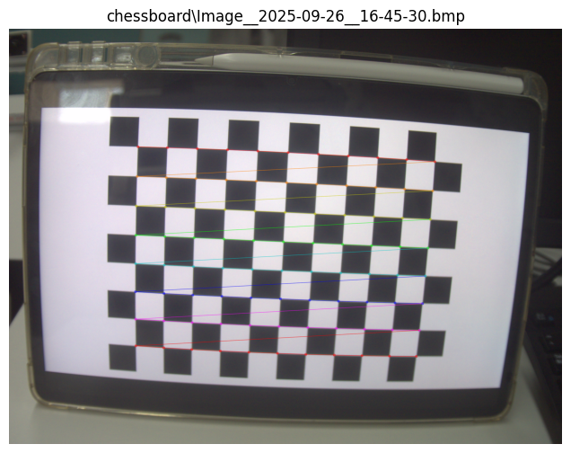
The output is as follows:
```
=== Intrinsic matrix (mtx) ===
[[3.66498106e+03 0.00000000e+00 1.25107241e+03]
 [0.00000000e+00 3.66359428e+03 9.39504971e+02]
 [0.00000000e+00 0.00000000e+00 1.00000000e+00]]

=== Distortion coefficients (dist) ===
[[-5.41559209e-01  3.68100960e-02  3.26237844e-03 -1.79983624e-04
   7.36295946e-01]]

=== Average reprojection error ===
0.7126619013786216
```

#### 1.3.2 Task 2: Impact of Different Factors

##### number of images vs. reprojection error
We performed camera calibration using 10, 20, 30, 40, 50, and 60 photos respectively, and the results are as follows:
```python
num_list = [10, 20, 30, 40, 50, 60]
error_list = []
for num in num_list:
    sub_obj = obj_points[:num]
    sub_img = img_points[:num]
    ret_sub, _, _, _, _ = cv2.calibrateCamera(sub_obj, sub_img, (w, h), None, None)
    error_list.append(ret_sub)
```
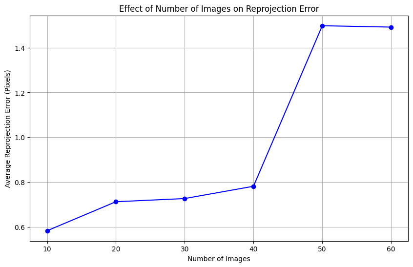

##### coverage of the chessboard vs. reprojection error
We divided the coverage of the chessboard into two groups: **large** (where the chessboard touches the edges or corners of the image, i.e., it touches the edges in two directions simultaneously) and **small** (the remaining images, where the chessboard is positioned at the center of the image). The results are as follows:
```python
def get_coverage_level(corners, img_w, img_h):
    corners_xy = corners.reshape(-1, 2)
    x_coords, y_coords = corners_xy[:, 0], corners_xy[:, 1]
    x_min, x_max, y_min, y_max = x_coords.min(), x_coords.max(), y_coords.min(), y_coords.max()

    (edge_x, edge_y) = 0.2 * (img_w, img_h)
    
    touch_left, touch_right = (x_min < edge_x), (x_max > (img_w - edge_x))
    touch_top, touch_bottom = (y_min < edge_y), (y_max > (img_h - edge_y))
    
    touch_corner = (touch_left and touch_top) or (touch_right and touch_top) or (touch_left and touch_bottom) or (touch_right and touch_bottom)
    
    if touch_corner:
        return 'large'
    else:
        return 'small'
```
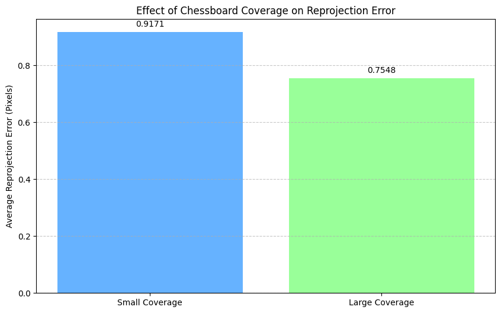

##### view angle vs. reprojection error
We obtained the shooting angles of each photo using the rotation vector of the photo: the angles range from 1.6° to 34.6°, and are divided into two groups (**large** and **small**) with 15° as the dividing line. The results are as follows:
```python
# ===============AI generated==============================
angles = []
for rvec in rvecs:
    R, _ = cv2.Rodrigues(rvec)  # 旋转矩阵
    camera_z = R[:, 2]  # 相机光轴方向向量
    cos_theta = abs(camera_z[2])
    theta = math.degrees(math.acos(cos_theta))  # 视角角度（°）
    angles.append(theta)

print(f"Angle：{min(angles):.1f}° - {max(angles):.1f}°")
# =========================================================
threshold = 15
small_angle = []
large_angle = []

for i in range(len(angles)):
    if angles[i] < threshold:
        small_angle.append(i)
    else:
        large_angle.append(i)
```
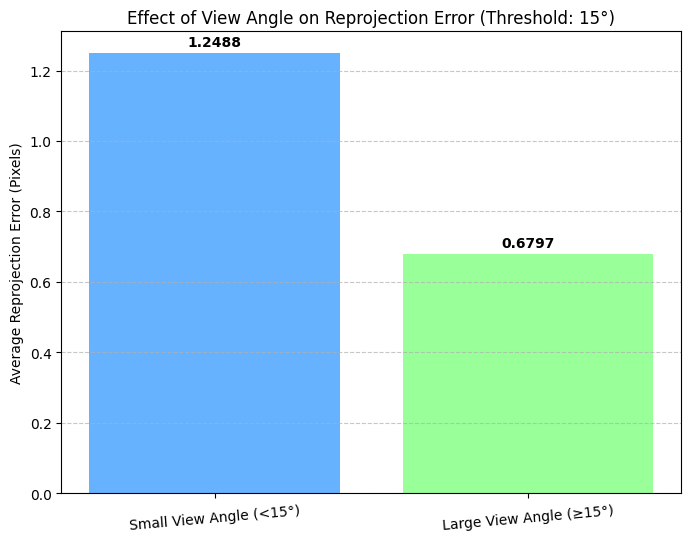


#### 1.3.3 Task 3: PLY File Generation (`generate_ply.py`)

##### Step 1:Load Calibration Parameters
The script reads the `Calibration_Results/calibration_params.npz` file to extract essential extrinsic parameters:
- rvecs: Rotation vectors (each corresponds to one calibration image)
- tvecs: Translation vectors (each corresponds to one calibration image) 


##### Step 2: Generate 3D Coordinates of Chessboard Corners
The correction of "dimension mismatch issues" in the code is critical to ensuring the accuracy of PLY visualization:


##### Step 3: Calculate Camera Centers
For each calibration image, the camera center (3D position of the camera in the world coordinate system) is computed by:
- Converting rotation vectors (rvecs) to rotation matrices via cv2.Rodrigues().
- Applying the formula: $camera_{center} = -R.T @  tvec$  (where R is the rotation matrix, tvec is the translation vector).
- Reshaping the result to ensure dimensional consistency for subsequent processing.
##### Step 4: Export to PLY File
- Merge chessboard corner points and camera center points into a single point cloud.
- Assign colors for distinction: red for chessboard corners, blue for camera centers.
- Write the point cloud data into a .ply file.


#### 1.3.4 Task 4 : AR Projection (`code.py，fucntion:project_cube_to_image`)


##### Step 1: Define Virtual 3D Cube
A 3D cube model is defined with 8 vertices and 6 colored faces (for intuitive depth perception). The cube’s size is linked to the chessboard’s physical dimensions (cube_size = square_size * 2), ensuring the projection scale is consistent with the real scene.
##### Step 2: Pre-Projection: Image Undistortion
Before projecting the cube, images are undistorted to correct lens distortion—this ensures the cube projection aligns with the "true" perspective of the scene. The process uses `cv2.getOptimalNewCameraMatrix()` and `cv2.undistort()`

##### Step 3: 3D-to-2D Cube Projection
The virtual cube is projected onto undistorted images using cv2.projectPoints(), which transforms 3D vertices into 2D pixel coordinates by accounting for:intrinsic parameters and
extrinsic parameters (rvec, tvec).
Key steps:
- Projection: cv2.projectPoints(cube_3d, rvec, tvec, mtx, dist) outputs cube_2d (2D pixel coordinates of cube vertices).
- Coordinate Adjustment: Since undistorted images are cropped to roi, cube_2d coordinates are offset by (x_roi, y_roi) to align with the cropped image.
- Face & Edge Rendering:
   - Semi-transparent faces: Drawn with cv2.fillConvexPoly() and blended with the undistorted image (alpha=0.5 via cv2.addWeighted()), ensuring the chessboard remains visible.
   - White edges: Drawn with cv2.line() (thickness=2) to define the cube’s 3D shape.

##### Step 4 : Result Saving 
To avoid redundant computation, the module processes a subset of valid images (up to 3, configurable) and saves outputs to the Calibration_Results directory:
- Filename format: undistorted_with_colored_cube_{i}.png (where i is the image index).
- Example output: An undistorted chessboard image with a semi-transparent colored cube overlaid, showing correct perspective alignment (e.g., the cube’s base face lies flat on the chessboard).


### 1.4 Result Analysis & Discussion

#### 1.4.1 Camera Calibration
This section only gets the camera calibration result. The details will be discussed in the next section.

#### 1.4.2 Impact of Different Factors

##### number of images vs. reprojection error
As can be seen from the figure, the average reprojection error increases as the number of images increases. When the number of images exceeds 60, the error surges to more than 1. When the number of images is extremely small (10 images), the sample variation range is small, and the results are more consistent, but there may be a deviation from the true value. When the number of samples is 20 or 30, the perspective variation and the number of images are balanced, resulting in relatively reasonable results. When the number of images is excessive (more than 50), due to the uneven quality of different images and the influence of environmental noise, errors will be introduced into the calibration itself, and the error accumulation effect caused by the number of images is also very significant. Therefore, **the appropriate number of images for camera calibration should be 20-30**.

##### coverage of the chessboard vs. reprojection error
There are 14 images with small chessboard coverage and 46 images with large chessboard coverage. We selected 14 images from each category for camera calibration. It can be observed that the average reprojection error of the group with large coverage is significantly lower than that of the group with small coverage. This is because large coverage provides stronger field-of-view constraints for the calibration algorithm and reduces the ambiguity in the estimation of intrinsic parameters and distortion coefficients. Specifically, large coverage offers more comprehensive **field-of-view sampling information** and avoids **redundancy in point set distribution**, thereby enhancing the uniqueness of constraints.

##### view angle vs. reprojection error
In the study on the influence of viewing angles, there are 15 photos with angles less than 15°, and 45 photos with angles greater than 15°. The average reprojection error of the large-angle group is smaller, which is consistent with the camera calibration principle. This is due to the following two reasons:
1. Stronger perspective constraints: The chessboard under a large viewing angle (with significant tilt) exhibits obvious perspective distortion of "near larger, far smaller". This distortion contains richer camera pose information (rotation and translation), which can provide stronger constraints for the calibration algorithm and reduce the ambiguity in the estimation of intrinsic parameters (such as distortion coefficients).
2. More three-dimensional point set distribution: Under a large viewing angle, the distribution of chessboard corners in the image is more scattered (even covering the edges/corners), which is equivalent to providing "more three-dimensional" sampling information. Compared with small viewing angles (frontal view, with point sets concentrated in the center), it can better reflect the true imaging characteristics of the camera.
   
##### other factors
Other potential influencing factors also include the clarity and flatness of the chessboard, lighting and contrast, as well as slight movements of the chessboard. Since a fixed tablet was used to display the images in this experiment (we trust the retina display and glass craftsmanship of the tablet), and the shooting was completed within a short period of time, the aforementioned factors are not considered.


#### 1.4.3 PLY Visualization
***Visualization Result of the Camera-Chessboard System*** 
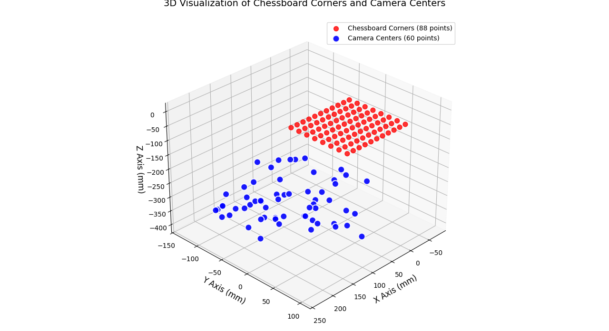
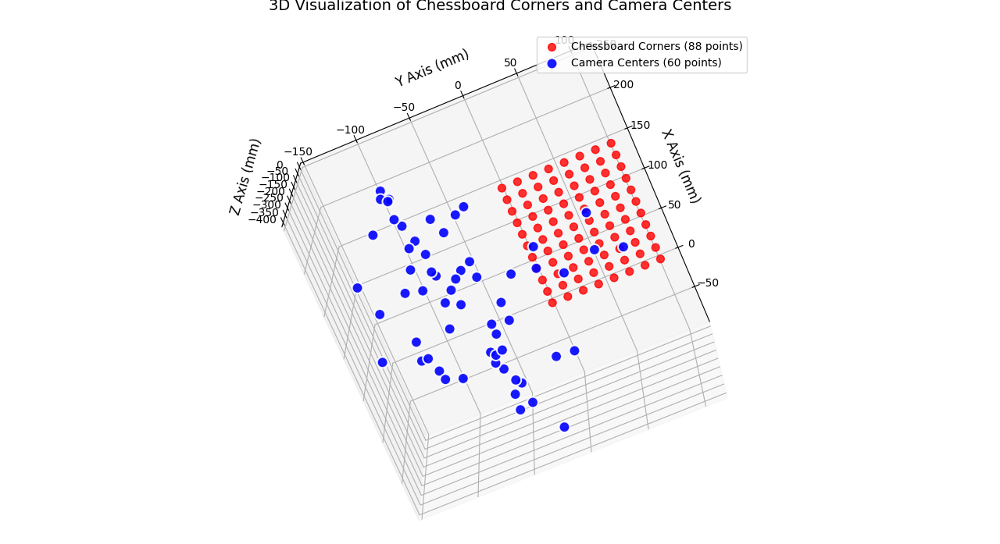
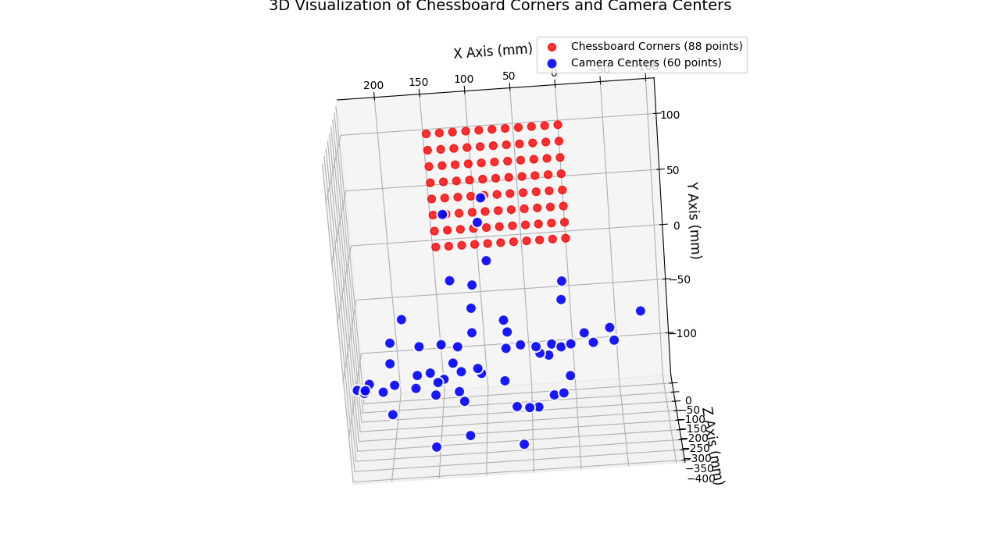
In the point cloud map, it can be seen that the chessboard plane is in the xy plane,and  camera angles follows the positive direction of the Z-axis.
*The pointcloud file is in `Calibration_Results`.*
In addition, a series of comparison pictures of the undistorted photos and original photos are provided here, which can visually show the correctness of the calibration
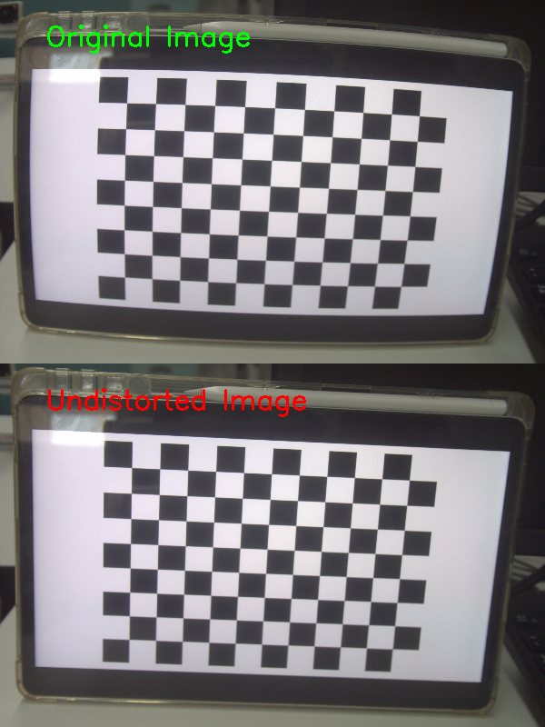
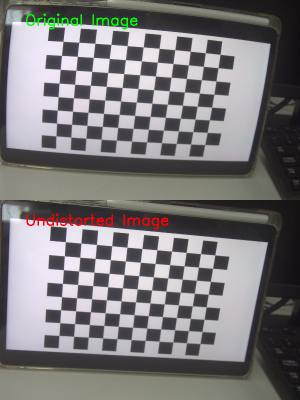
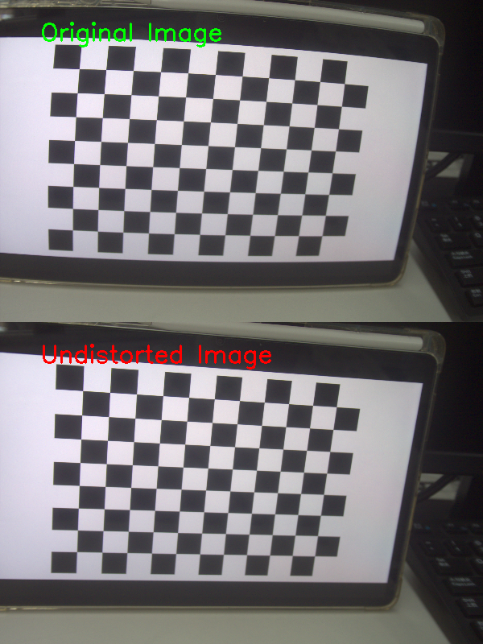

#### 1.4.4 AR Projection

Here we give images about undistorted chessboard with colored cube from different angle.
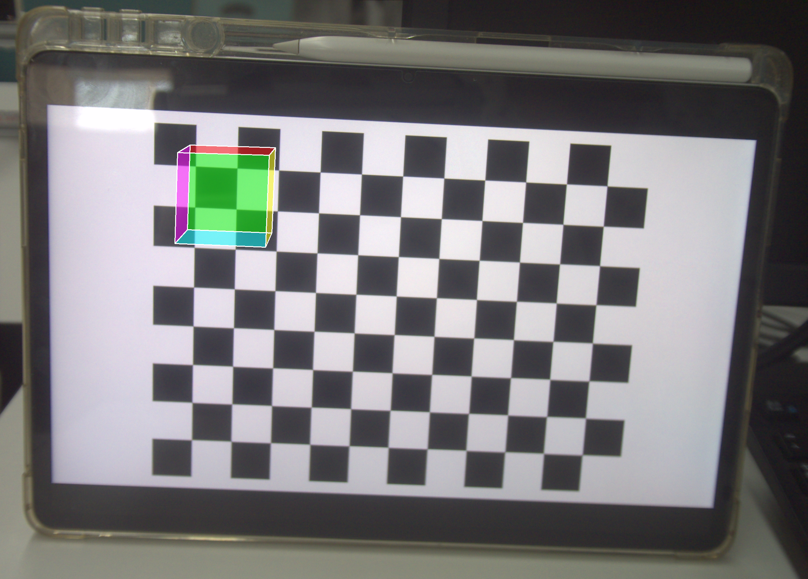
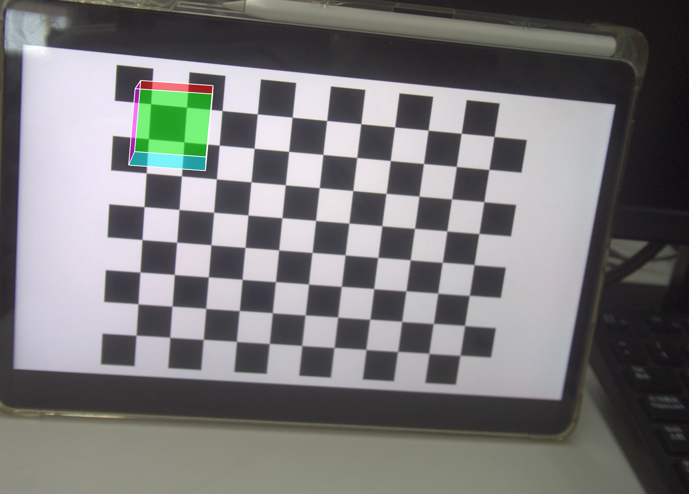
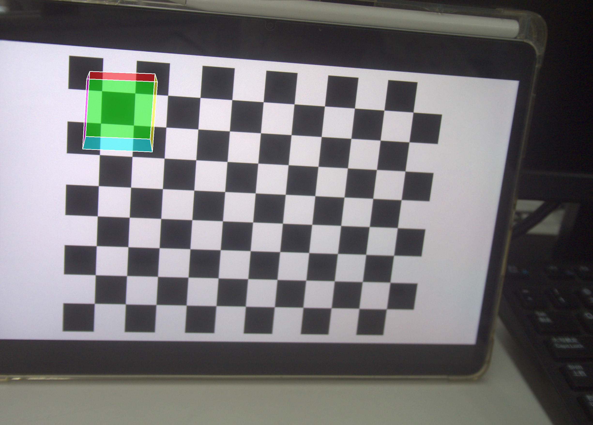
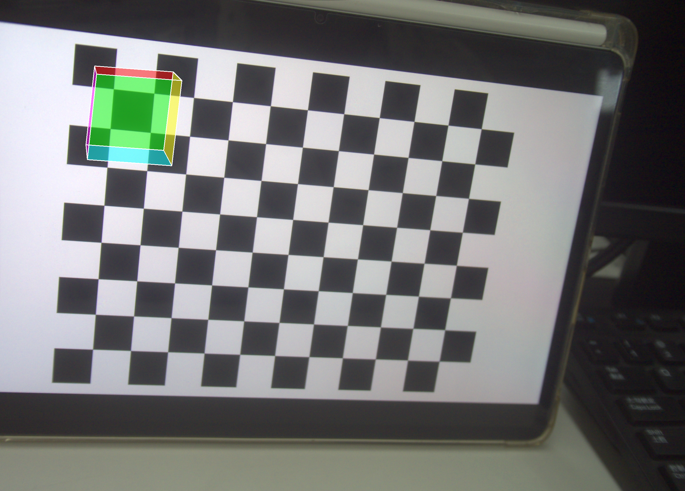
The colored cube aligns with the chessboard’s perspective:
- The cube’s base face lies flat on the chessboard plane
- Distant cube faces appear smaller (consistent with perspective projection).
- Colored faces and white edges make the cube’s 3D structure easily distinguishable.

### 1.5 Experiment Conclusion
1. **Task Completion**:  
   - **Task 1 & 2**: As we have shown in the previous section.
   - **Task 3**: `generate_ply.py` successfully visualizes the camera-chessboard system, with good spatial consistency between camera centers and the chessboard point cloud—verifying the accuracy of extrinsic parameters.  
   - **Task 4**: `code.py,function:project_cube_to_image` and `AR_cube.py` realize stable AR projection  simple (cube) . The models align with the chessboard, proving that calibration parameters can be applied to practical AR scenarios.  

2. **Key Takeaway**:  
All results rely on the **consistency of parameters and logic** across code files. This consistency ensures that calibration results are reusable, and AR/PLY tasks can be completed without re-collecting data—highlighting the advantages of the modular design of the provided code.  
Tasks 1 & 2 and Tasks 3 & 4 were carried out nearly in parallel, as shown in `lab3_Saure.ipynb`. However, the part of Task 1 in two workflows are highly similar in terms of processing logic, returned parameter content, and other aspects. The only difference is that the camera calibration part in `lab3_Saure.ipynb` only serves Task 2 and does not participate in subsequent experimental operations.

## 2. Bonus Part
###  Colored Cube Projection (`AR_cube.py`)
###### Step 1: Define Cube Model (`define_colored_cube()` Function)
1. **Vertex Calculation**: For a 50 mm-sized cube centered at (80, 60, 0) mm, calculate the coordinates of 8 vertices:  
   - Half-size = 25 mm; vertices include front (Z=25) and back (Z=-25) faces (e.g., front-left-bottom vertex: `(-25, -25, 25)`).  
   - Translate vertices to the target position: `vertices += cube_position` (ensures the cube is centered and overlaid on the chessboard).  
2. **Face Definition**: Define 6 faces using vertex indices (e.g., front face: `[0,1,2,3]`, back face: `[4,5,6,7]`).  


###### Step 2: Real-Time Projection (`ar_cube_projection()` Function)
1. **Load Calibration Data and Initialize Camera**: Load `mtx` and `dist` via the `load_calibration_params()` function, open the camera, and set the resolution to 1280×720 to balance speed and clarity.  
2. **Corner Detection and Extrinsic Estimation**:  
   - Convert each frame to grayscale, call the `findChessboardCorners` function to detect corners (using adaptive threshold/normalization flags to improve stability).  
   - Refine corners using the `cornerSubPix` function.  
   - Generate chessboard world coordinates `objp`, then call the `solvePnP(objp, corners_refined, mtx, dist)` function to estimate extrinsic parameters—the code uses an "extrinsic cache" optimization: if detection fails, it reuses the `rvec`/`tvec` from the previous frame to avoid model disappearance.  
3. **3D-to-2D Projection and Rendering**:  
   - Vertex projection: `cube_2d, _ = cv2.projectPoints(cube_vertices, rvec, tvec, mtx, dist)`—reshape the result into (8,2) integer pixel coordinates.  
   - Draw semi-transparent faces: Create an overlay, fill each face with `face_colors` using the `fillPoly` function, then blend it with the original frame via the `addWeighted` function.  
   - Draw white edges: Outline face boundaries using the `polylines` function to solve the "boundary blur" issue.  

###  Result
Run `AR_cube.py` to check the real-time projection.
Here we give some screenshot of the real-time projection,and we a demo video is in `Data\video`

## 3. Use of AI
During the lab, we use AI to understand the theories(Doubao), reference the code(Doubao), verificate the correctness of the images(Doubao) and generate some repetitive code(Doubao & Copilot), as well as to translate the part of the report into Chinese(Doubao).

**To understand the theories and verificate the correctness of the images**:  
Doubao: [https://www.doubao.com/thread/w278de859d7df5103](https://www.doubao.com/thread/w278de859d7df5103)
Doubao: [https://www.doubao.com/thread/w0090bccf190fdc4e](https://www.doubao.com/thread/w0090bccf190fdc4e)


**To generate some repetitive code**:  
Doubao & Copilot: [https://www.doubao.com/thread/w4bd69612f4cc51eb](https://www.doubao.com/thread/w4bd69612f4cc51eb)
Some code is generated by Doubao and was used in our code, we have declared the code in the report.
```python
# ===============AI generated==============================
angles = []
for rvec in rvecs:
    R, _ = cv2.Rodrigues(rvec)  # 旋转矩阵
    camera_z = R[:, 2]  # 相机光轴方向向量
    cos_theta = abs(camera_z[2])
    theta = math.degrees(math.acos(cos_theta))  # 视角角度（°）
    angles.append(theta)

print(f"Angle：{min(angles):.1f}° - {max(angles):.1f}°")
# =========================================================
```

**To translate the part of the report into Chinese**:  
Doubao: [https://www.doubao.com/thread/w6e37930fbd33073f](https://www.doubao.com/thread/w6e37930fbd33073f)
