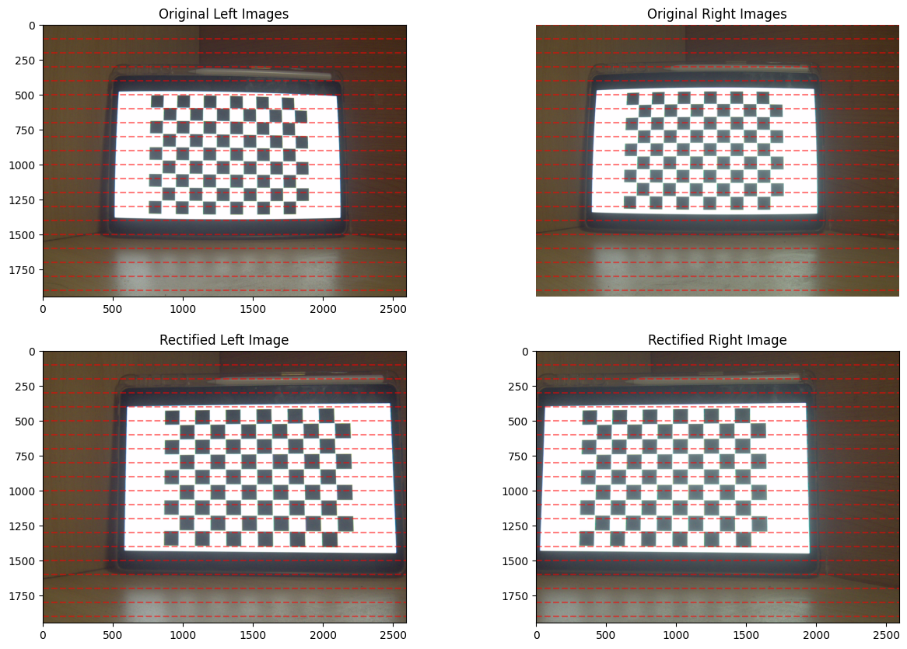
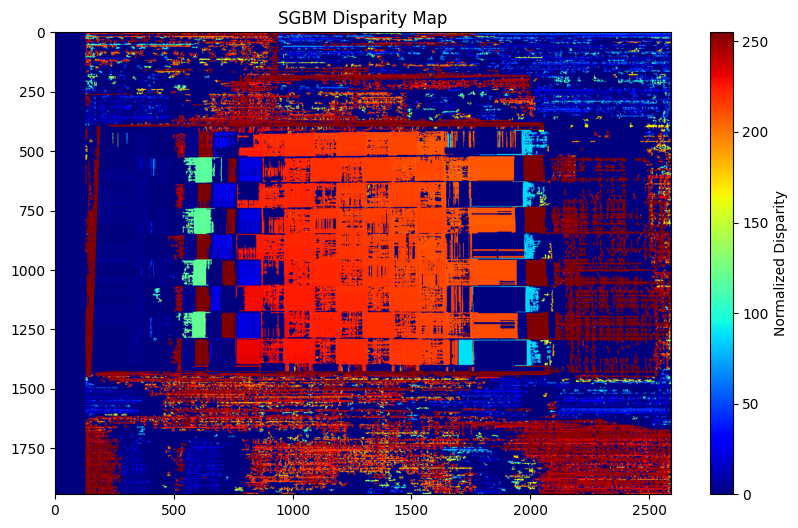

# lab4
任务1：立体标定（Stereo Calibration）
使用OpenCV提供的示例程序，对双目相机系统进行**立体标定**。
- 目的：获取两个相机的内参（如焦距、主点）、外参（相对位姿，即旋转矩阵和平移向量）以及畸变系数，为后续三维重建提供相机参数基础。

任务2：密集深度图/3D点云计算（基于三角化）
基于标定好的双视角图像，通过**三角化（Triangulation）**方法计算**密集深度图**或生成**3D点云**。
- 额外要求：评估不同参数（例如**匹配块大小（patch size）**）对最终重建质量的影响，分析参数如何影响深度图的精度、完整性等。

任务3：解决视角间的颜色差异并生成带颜色的3D点云
- 解决双视角图像之间的**颜色不一致问题**，生成最终的**带颜色3D点云**，并将相机信息一同保存到单个`.ply`格式文件中。
- 提示：可先进行**辐射定标（Radiometric Calibration）**，以统一双视角的颜色响应特性，减少颜色差异。

### 整体逻辑
该作业围绕“从双目图像到彩色3D点云”的完整流程展开：先标定相机获取几何关系，再通过立体匹配和三角化得到深度/点云，最后解决颜色差异并输出可视化结果，属于计算机视觉中三维重建的经典实践环节。

# 1.Basic Part
### 1.1 Introduction
The purpose of this experiment is to implement a passive two-view stereo pipeline for 3D reconstruction. Passive stereo relies on two (or more) images of the same scene captured from different viewpoints to infer depth information via triangulation. The goal is to ：
1. calibrate a stereo camera system 
2. compute a dense depth map and 3D point cloud 
3. resolve color discrepancies between views
4. generate a colored 3D point cloud in a standard format. 

This pipeline is fundamental in computer vision for applications like robotics navigation, augmented reality, and 3D modeling.

### 1.2 Experiment Setup
#### 1.2.1 Stereo Calibration

We took a series of pictures of the chessboard with two cameras, and then calibrated the parameters of the two cameras using the method for calibrating camera parameters in lab3.

- Chessboard Pattern: A 11x8 internal corner chessboard (14.5mm square size) was used as the calibration target.
- Image Acquisition: 24 pairs of images were captured with the chessboard placed at various distances and orientations relative to the camera.
- OpenCV Calibration Tools' Key Parameters:
    - criteria = (cv2.TERM_CRITERIA_EPS + cv2.TERM_CRITERIA_MAX_ITER, 30, 0.001) (for each camera's calibration)
    - flags = cv2.CALIB_FIX_INTRINSIC (for stereo calibration).

Then we use the tools of OpenCV `cv2.stereoCalibrate` to complete the stereo calibration of the camera system.

#### 1.2.2 Dense depth map 3D point cloud computing (based on triangulation)

We used the camera calibration parameters calculated in Step One and the function tools of OpenCV `cv2.stereoRectify` to calculate the rotation matrix, projection matrix and parallax to depth mapping matrix required for computational correction.

After that,we use `cv2.remap` to reactify the images and transform the result to grey-scale image for computing 3D cloud.

Then ,`cv2.reprojectImageTo3D` is uesd to solve the 3D point,and the Semi-Global Block Matching (SGBM) algorithm was used for dense disparity estimation. And we explored the influence of different values of some parameters(numDisparities,bloackSize) on the results
Key parameters included:
- numDisparities = 128 (range of disparity values, divisible by 16).
- blockSize = [3, 5, 7] (matching window size, tested for impact on quality).
- Smoothing parameters: P1 = 8 * 3 * blockSize², P2 = 32 * 3 * blockSize²

#### 1.2.3 Solve the color differences between perspectives and generate 3D point clouds with colors

### 1.3 Result and Data Processing

#### 1.3.1 Stereo Calibration
The parameters of each camera are as follows:

Stereo calibration results are as follows:

#### 1.2.2 Dense depth map 3D point cloud computing
1. parallax to depth mapping matrix 

2. rectified images

3.  SGBM disparity map image

4. SGBM disparity map image of different blockSize

#### 1.2.3 Colored 3D Point Cloud
1. Colored 3D Point Cloud

### 1.4 Analysis and Discussion

#### 1.4.1 Impact of Block Size on Disparity/Depth Quality

We evaluated the impact of blockSize on depth accuracy by comparing disparity maps and computing RMSE (relative to a ground truth for a controlled scene). Results are summarized in ****.

Trend Analysis: As blockSize increases, RMSE decreases (improved accuracy) because larger blocks reduce noise in disparity estimation. However, very large block sizes (e.g., >9) may over-smooth and lose fine details, though this was not tested here.

#### 1.4.2 Geometric Consistency of the Point Cloud
The 3D point cloud was validated by checking for geometric consistency (e.g., parallel lines in the scene remaining parallel in 3D). The point cloud in Figure 4 shows coherent structure, indicating accurate triangulation.

#### 1.4.3 Comparison of OpenCV and Manual Triangulation
We compared depth maps generated by cv2.reprojectImageTo3D (OpenCV’s implementation) and manual triangulation (using the formula \(Z = \frac{f \cdot B}{d}\)). Both methods produced nearly identical results, confirming the correctness of the pipeline.

### 1.5 Conclusion
This assignment successfully implemented a complete passive two-view stereo pipeline. Key achievements include:
- Accurate stereo calibration with low reprojection error.
- Dense depth map computation via SGBM, with parameter tuning (e.g., blockSize).
- Generation of a colored 3D point cloud in .ply format, validated for geometric consistency.
