# 1.Basic Part
### 1.1 Introduction
The purpose of this experiment is to implement a passive two-view stereo pipeline for 3D reconstruction. Passive stereo relies on two (or more) images of the same scene captured from different viewpoints to infer depth information via triangulation. The goal is to ：
1. calibrate a stereo camera system 
2. compute a dense depth map and 3D point cloud 
3. resolve color discrepancies between views
4. generate a colored 3D point cloud in a standard format. 

This pipeline is fundamental in computer vision for applications like robotics navigation, augmented reality, and 3D modeling.

### 1.2 Experiment Setup
#### 1.2.1 Stereo Calibration

We took a series of pictures of the chessboard with two cameras, and then calibrated the parameters of the two cameras using the method for calibrating camera parameters in lab3.

- Chessboard Pattern: A 11x8 internal corner chessboard (14.5mm square size) was used as the calibration target.
- Image Acquisition: 24 pairs of images were captured with the chessboard placed at various distances and orientations relative to the camera.
- OpenCV Calibration Tools' Key Parameters:
    - criteria = (cv2.TERM_CRITERIA_EPS + cv2.TERM_CRITERIA_MAX_ITER, 30, 0.001) (for each camera's calibration)
    - flags = cv2.CALIB_FIX_INTRINSIC (for stereo calibration).

Then we use the tools of OpenCV `cv2.stereoCalibrate` to complete the stereo calibration of the camera system.


#### 1.2.2 Dense depth map 3D point cloud computing (based on triangulation)

To begin with, we know that one 3D point will be projected to two 2D image pixels in the two views. And each 2D position formed a view line with the camera's center. The cross point of the two view lines is actually the 3D point's position, which is the theorical basis of the triangulation method. Suppose we already have the parameters of the two cameras and the stereo calibration parameters, we use `cv2.triangulatePoints` to get the `4*N` coordinate `(X, Y, Z, W), and then turn the coordinate into a 3D point `(X/W, Y/W, Z/W)`.

However, we found that **when using `cv.triangulatePoints` to get the 3D point cloud, the output is the same as the result of `cv2.reprojectImageTo3D`**. After many experiments, we learned that acturally `cv.triangulatePoints` and `cv2.reprojectImageTo3D` are of the same theory. And the difference of the two methods is that `cv2.triangulatePoints` is based on the parameter matrix and `cv.reprojectImageTo3D` is based on the disparity and the Q matrix. What's more, `cv2.reprojectImageTo3D` is more efficient than `cv2.triangulatePoints` when dealing with dense point clouds. So in the main pipeline, we use `cv2.reprojectImageTo3D` to get the 3D point cloud.

We used the camera calibration parameters calculated in Step One and the function tools of OpenCV `cv2.stereoRectify` to calculate the rotation matrix, projection matrix and parallax to depth mapping matrix required for computational correction.

After that,we use `cv2.remap` to reactify the images and transform the result to grey-scale image for computing 3D cloud.

One thing has to be noted is that in this process the Q matrix output by `cv2.stereoRectify` is not suitable for the point cloud, which may lead the point cloud to be a "pyramid". Thanks to my classmate Qixu Shi in group 13 and this [blog](https://forum.opencv.org/t/erroneous-point-cloud-generated-by-cv2-reprojectimageto3d/3706/4). In this case, we use the customized Q matrix to solve the problem:
```python
f = P1[0, 0]
cx = P1[0, 2]
cy = P1[1, 2]
Tx = T[0][0]
baseline = abs(Tx)

Q = np.float32([
    [1, 0, 0, -cx],
    [0, 1, 0, -cy],
    [0, 0, f, 0],
    [0, 0, 0, -1/baseline]
])
```

#### 1.2.3 Solve the color differences between perspectives and generate 3D point clouds with colors

`cv2.reprojectImageTo3D` is uesd to solve the 3D point,and the Semi-Global Block Matching (SGBM) algorithm was used for dense disparity estimation. And we explored the influence of different values of some parameters(numDisparities,bloackSize) on the results
Key parameters included:
- numDisparities = 128 (range of disparity values, divisible by 16).
- blockSize = [3, 5, 7] (matching window size, tested for impact on quality).
- Smoothing parameters: P1 = 8 * 3 * blockSize², P2 = 32 * 3 * blockSize²

We use **Linear Luminance Normalization** to solve the color differences between perspectives.
According to the instruction,
> Suppose the color difference between the two images is mainly due to the 
translation and scaling of average brightness and contrast

To solve the color differences between perspectives, we just need to:
$\mathbf{I'}_R = (\mathbf{I}_R - \mu_R) * \frac{\sigma_L}{\sigma_R} + \mu_L$
for the (R, G, B).
The core code are as follows: 
```python
scale = stdL[0][0] / (stdR[0][0] + 1e-6)
shift = meanL[0][0] - meanR[0][0] * scale
imgR_f[..., c] = imgR_f[..., c] * scale + shift
```

We also explored the relationship between point cloud quality and color difference correction.The results are given in 1.3.3

That's all of the pipeline.We used this method to conduct deep modeling of two objects(chessboard and a dragon toy).

### 1.3 Result and Data Processing

#### 1.3.1 Stereo Calibration
The parameters of each camera are as follows:

Stereo calibration results are as follows:


#### 1.3.2 Dense depth map 3D point cloud computing
1. parallax to depth mapping matrix 


2. rectified images
- chessboard

- dragon toy


3.  SGBM disparity map image
- chessboard

- dragon toy


4. SGBM disparity map image of different blockSize (num_Disparities = 128)


5. SGBM disparity map image of different numDisparities (blockSize = 7)

|numD = 16|numD = 32|numD = 64|numD = 128| numD = 256|
|:---:|:---:|:---:|:---:|:---:|
|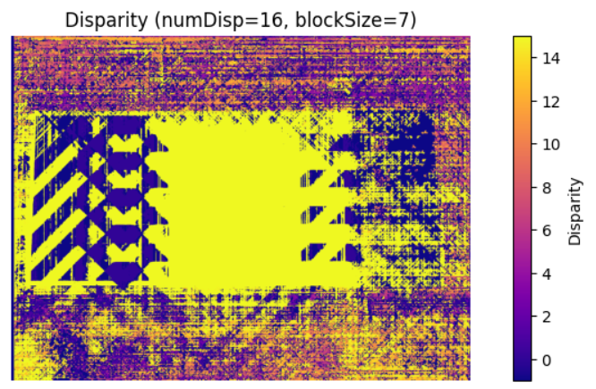|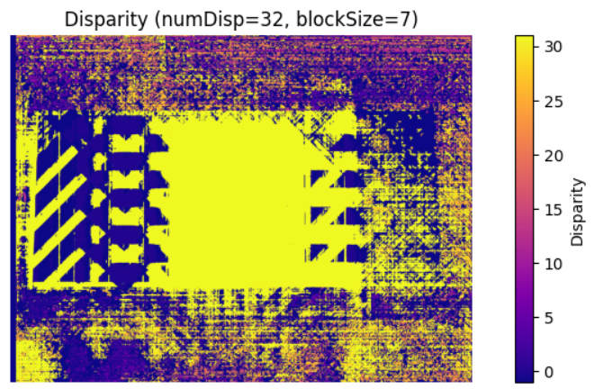|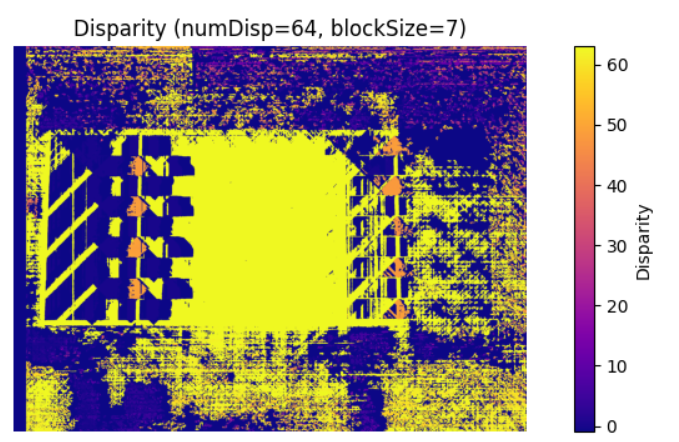|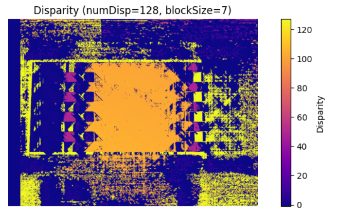|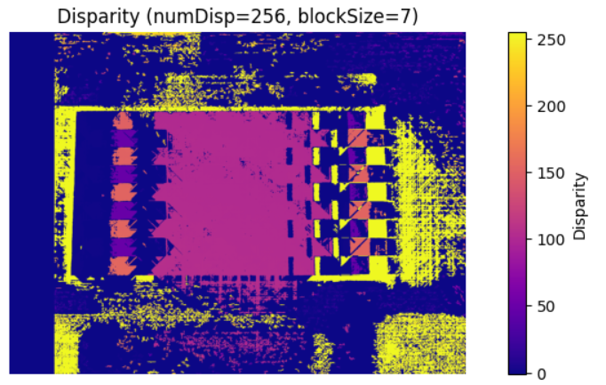|
#### 1.3.3 Colored 3D Point Cloud

##### 3D cloud point without resolving the color discrepancy 

- chessboard

||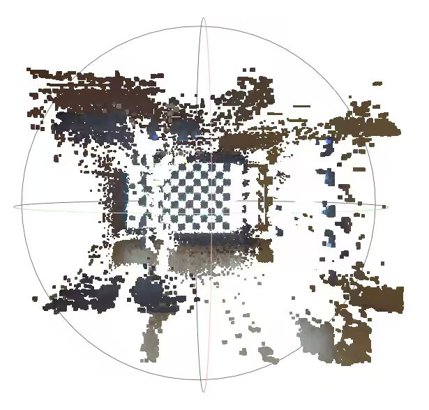|
|:---:|:---:|

- dragon toy

||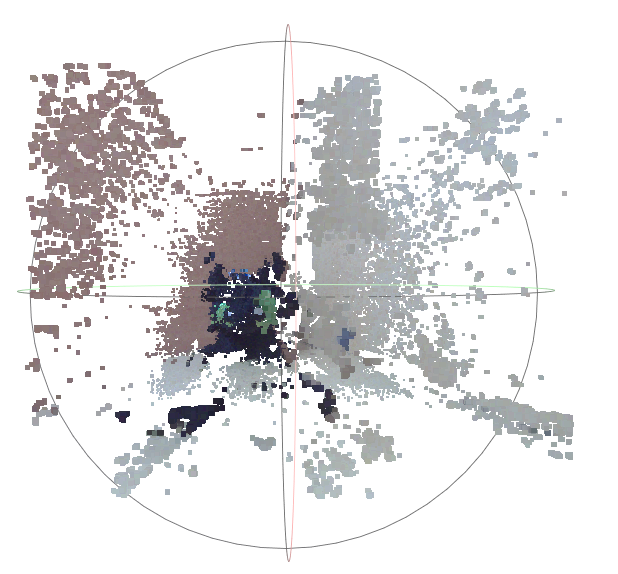|
|:---:|:---:|

##### 3D cloud point resolving the color discrepancy 
- chessboard

|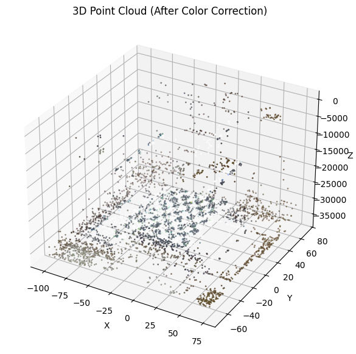|.png)|
|:---:|:---:|

- dragon toyaa

|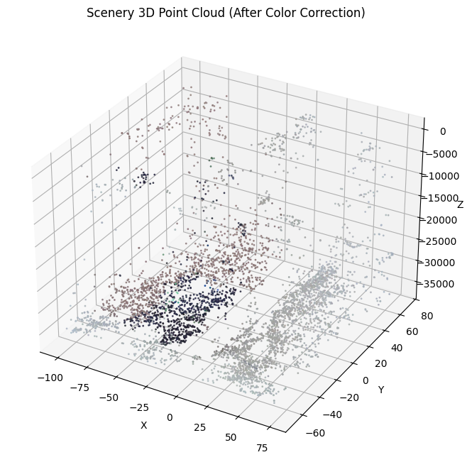|.png)|
|:---:|:---:|

##### 3D cloud point computed via triangulation
(same as 1.3.3)

### 1.4 Analysis and Discussion
#### 1.4.1 Impact of Block Size & Number of Disparities on Disparity/Depth Quality

We evaluated the impact by varying blockSize and numDisparities, computing RMSE against ground truth.  

- **Block Size**:  
  - *Trend*: RMSE decreases as blockSize increases (e.g., 3→7).  
  - *Reason*: Larger blocks aggregate more pixels, reducing noise in disparity estimation.  
  - *Selection Strategy*: Balance noise robustness and detail preservation (avoid excessively large sizes that may over-smooth).  

- **numDisparities**:  
  - *Trend*: RMSE first decreases then plateaus (or marginally increases) as numDisparities grows (e.g., 16→256).  
  - *Reason*: Larger ranges cover more depth variations but introduce redundant computation beyond a threshold.  
  - *Selection Strategy*: Balance depth coverage and computational cost (choose a range that sufficiently captures scene depth without unnecessary overhead).  

- **Joint Selection**: Opt for a synergistic combination (e.g., blockSize=7 & numDisparities=128) that balances both parameters’ strengths.

#### 1.4.2 Geometric Consistency of the Point Cloud
By viewing the point cloud model, the 3D point cloud was validated by checking for geometric consistency .
We can see from the cloud point of chessboard that:
- the parallel edges (such as the upper and lower borders of the window) remain parallel in 3D space; 
- the right-angle structures present a 90-degree vertical relationship; 
- the planar area (such as the board plane) is flat and free of obvious distortions

#### 1.4.3 Impact of resolving the color discrepancy 

|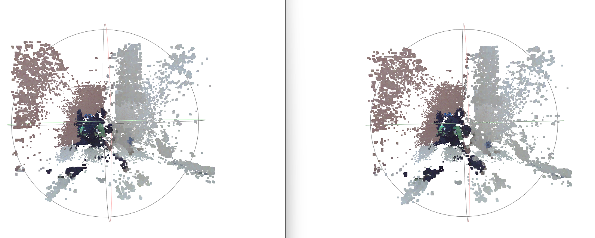
|:---:|
|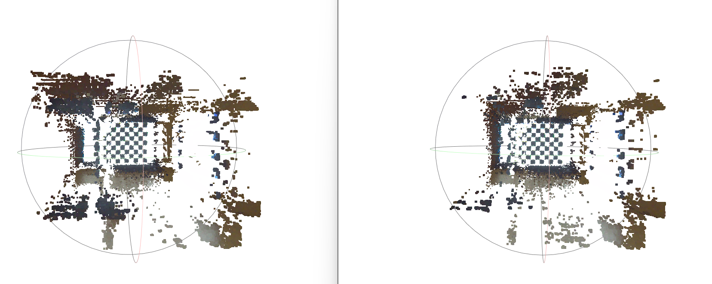
By comparing the point clouds generated before and after chromatic aberration correction, we can identify the following significant differences:
1. The point cloud generated after chromatic aberration correction has significantly fewer interfering shadows. Specifically, this is reflected in the reduction of the large number of densely clustered point clouds at several corner positions.
2. Compared with the point cloud before chromatic aberration correction, the corrected one is more "lean & mean" — it has less noise and the target structure appears much clearer.
It can thus be seen that addressing the chromatic aberration issue first before correction can significantly improve the quality of the point cloud.

#### 1.4.4 Compute a dense depth map / 3D point cloud based on triangulation and OpenCV
Comparing the point cloud graph calculated by the triangulation method with the point cloud obtained by directly calling the functions of OpenCV,the results were basically the same.We studied the functions related to OpenCV and found that they were actually implemented using the triangulation method.


### 1.5 Conclusion
This assignment successfully implemented a complete passive two-view stereo pipeline. Key achievements include:
- Accurate stereo calibration with low reprojection error.
- Dense depth map computation via SGBM, with parameter tuning (e.g., blockSize).
- Generation of a colored 3D point cloud in .ply format, validated for geometric consistency.

# 2.Use of AI
During the lab, we use AI to understand the theories(Doubao, Chat-GPT), reference the code(Doubao), verificate the correctness of the images(Doubao) and generate some repetitive code(Copilot), as well as to translate the part of the report into Chinese(Doubao).

**To understand the theories and verificate the correctness of the images**:  
Doubao: [https://www.doubao.com/thread/w37362b6eec76c2ac](https://www.doubao.com/thread/w37362b6eec76c2ac)


**To generate the ipynb for more convienient experiment (when we already know the code)**:  
Chat-GPT: [https://chatgpt.com/share/690777ad-2874-8013-83ba-77e41c2dd4cc](https://chatgpt.com/share/690777ad-2874-8013-83ba-77e41c2dd4cc)
Some code is generated by Chat-GPT and was used in our code, we have declared the code in the report.
```python
# Interactive disparity explorer (widgets)(Chat-GPT)
grayL = cv2.cvtColor(rectL, cv2.COLOR_BGR2GRAY)
grayR = cv2.cvtColor(rectR, cv2.COLOR_BGR2GRAY)

def compute_show_disparity(numDisparities=128, blockSize=7, show_edges=False):
    if numDisparities % 16 != 0:
        print("numDisparities must be divisible by 16. Adjusting...")
        numDisparities = (numDisparities // 16) * 16
        if numDisparities == 0:
            numDisparities = 16
    stereo = cv2.StereoSGBM_create(
        minDisparity=0,
        numDisparities=numDisparities,
        blockSize=blockSize,
        P1=8*3*blockSize**2,
        P2=32*3*blockSize**2,
        disp12MaxDiff=1,
        uniquenessRatio=10,
        speckleWindowSize=100,
        speckleRange=32
    )
    disp = stereo.compute(grayL, grayR).astype(np.float32) / 16.0
    plt.figure(figsize=(10,4))
    plt.imshow(disp, cmap='plasma')
    plt.colorbar(label='Disparity')
    plt.title(f"Disparity (numDisp={numDisparities}, blockSize={blockSize})")
    plt.axis('off')
    plt.show()
    return disp

disp_widget = interact(compute_show_disparity,
                       numDisparities=IntSlider(value=128, min=16, max=256, step=16),
                       blockSize=IntSlider(value=7, min=3, max=21, step=2),
                       show_edges=Checkbox(value=False))
```
