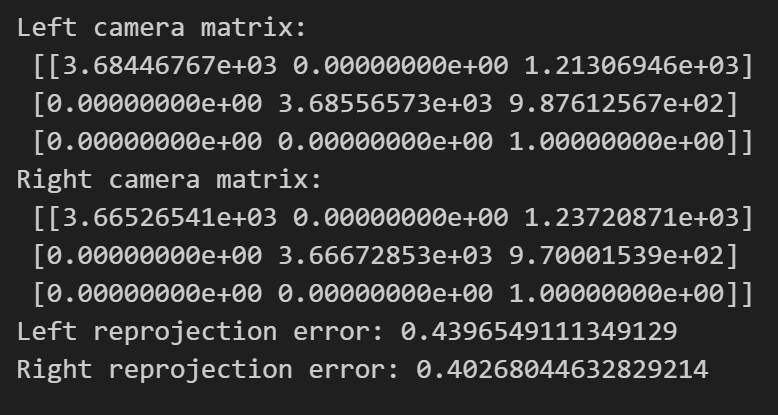
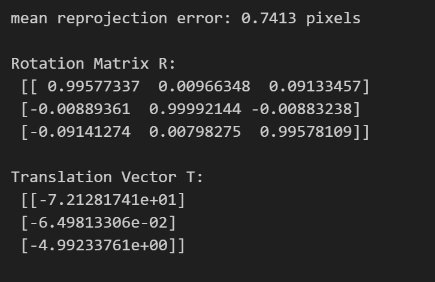
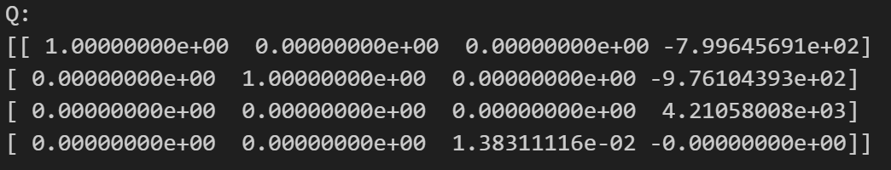
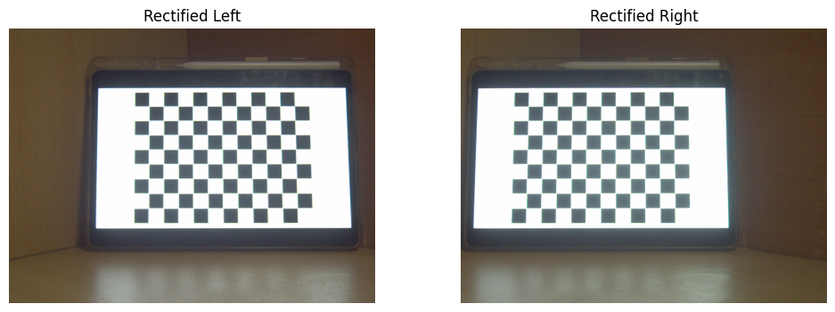
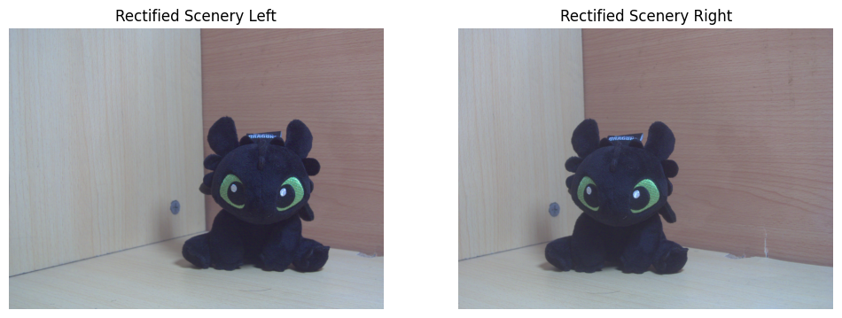
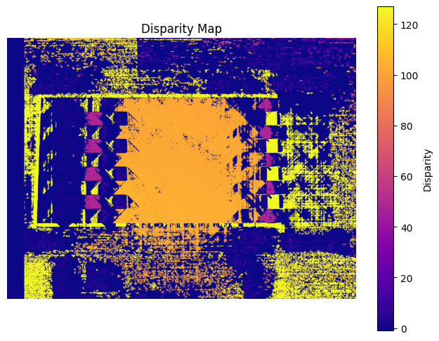
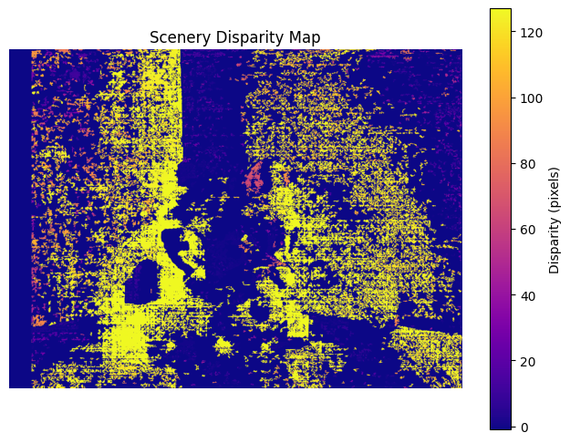
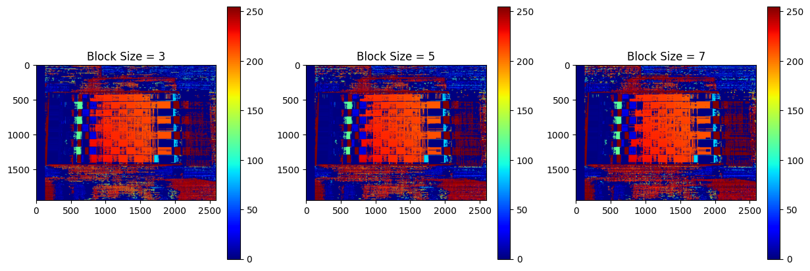
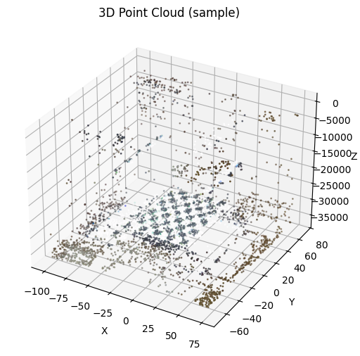
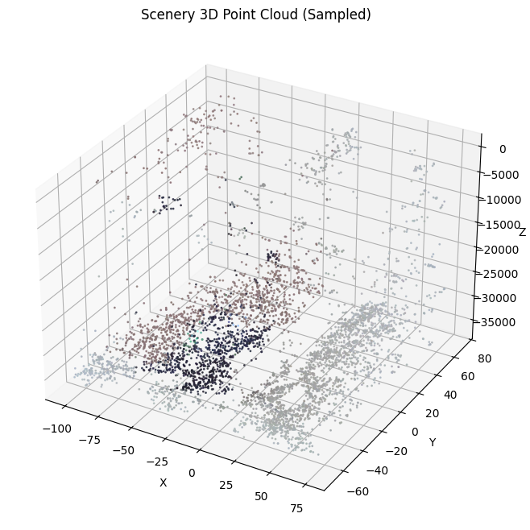

# 1.Basic Part
### 1.1 Introduction
The purpose of this experiment is to implement a passive two-view stereo pipeline for 3D reconstruction. Passive stereo relies on two (or more) images of the same scene captured from different viewpoints to infer depth information via triangulation. The goal is to ：
1. calibrate a stereo camera system 
2. compute a dense depth map and 3D point cloud 
3. resolve color discrepancies between views
4. generate a colored 3D point cloud in a standard format. 

This pipeline is fundamental in computer vision for applications like robotics navigation, augmented reality, and 3D modeling.

### 1.2 Experiment Setup
#### 1.2.1 Stereo Calibration

We took a series of pictures of the chessboard with two cameras, and then calibrated the parameters of the two cameras using the method for calibrating camera parameters in lab3.

- Chessboard Pattern: A 11x8 internal corner chessboard (14.5mm square size) was used as the calibration target.
- Image Acquisition: 24 pairs of images were captured with the chessboard placed at various distances and orientations relative to the camera.
- OpenCV Calibration Tools' Key Parameters:
    - criteria = (cv2.TERM_CRITERIA_EPS + cv2.TERM_CRITERIA_MAX_ITER, 30, 0.001) (for each camera's calibration)
    - flags = cv2.CALIB_FIX_INTRINSIC (for stereo calibration).

Then we use the tools of OpenCV `cv2.stereoCalibrate` to complete the stereo calibration of the camera system.

#### 1.2.2 Dense depth map 3D point cloud computing (based on triangulation)

# TODO:这里我只写了怎么用OPENCV 做的，需要补充三角化计算
# 可以先说我们用三角化方法进行了计算，然后用如下的OpenCV的方法进行了计算。

We used the camera calibration parameters calculated in Step One and the function tools of OpenCV `cv2.stereoRectify` to calculate the rotation matrix, projection matrix and parallax to depth mapping matrix required for computational correction.

After that,we use `cv2.remap` to reactify the images and transform the result to grey-scale image for computing 3D cloud.

#### 1.2.3 Solve the color differences between perspectives and generate 3D point clouds with colors

`cv2.reprojectImageTo3D` is uesd to solve the 3D point,and the Semi-Global Block Matching (SGBM) algorithm was used for dense disparity estimation. And we explored the influence of different values of some parameters(numDisparities,bloackSize) on the results
Key parameters included:
- numDisparities = 128 (range of disparity values, divisible by 16).
- blockSize = [3, 5, 7] (matching window size, tested for impact on quality).
- Smoothing parameters: P1 = 8 * 3 * blockSize², P2 = 32 * 3 * blockSize²

# TODO:这里说明一下矫正色差的方法，如果调了函数，写一下参数
We use **** to solve the color differences between perspectives.
Parameters are  as follow:

We also explored the relationship between point cloud quality and color difference correction.The results are given in 1.3.3

That's all of the pipeline.We used this method to conduct deep modeling of two objects(chessboard and a dragon toy).

### 1.3 Result and Data Processing

#### 1.3.1 Stereo Calibration
The parameters of each camera are as follows:

Stereo calibration results are as follows:

#### 1.3.2 Dense depth map 3D point cloud computing
1. parallax to depth mapping matrix 

2. rectified images
- chessboard

- dragon toy

3.  SGBM disparity map image
- chessboard

- dragon toy

4. SGBM disparity map image of different blockSize

#### 1.3.3 Colored 3D Point Cloud

##### 3D cloud point without resolving the color discrepancy 

1. Colored 3D Point Cloud in matplotlib.pyplot
- chessboard

- dragon toy

2. Colored 3D Point Cloud in meshlib
- chessboard

- dragon toy

# TODO :在这里粘贴上色差矫正过后的3d点云图片
##### 3D cloud point resolving the color discrepancy 
- chessboard
  

- dragon toy

# TODO：这里贴上用三角化做的3D点云的图片
##### 3D cloud point computed via triangulation

### 1.4 Analysis and Discussion

# TODO:我在实验步骤里写我们研究了 blocksize 和 numdisparity 两个参数的影响。这里需要你做一下。
#### 1.4.1 Impact of Block Size on Disparity/Depth Quality

We evaluated the impact of blockSize on depth accuracy by comparing disparity maps and computing RMSE (relative to a ground truth for a controlled scene). Results are summarized in ****.

Trend Analysis: As blockSize increases, RMSE decreases (improved accuracy) because larger blocks reduce noise in disparity estimation. However, very large block sizes (e.g., >9) may over-smooth and lose fine details, though this was not tested here.

#### 1.4.2 Geometric Consistency of the Point Cloud
By viewing the point cloud model, the 3D point cloud was validated by checking for geometric consistency .
We can see from the cloud point of chessboard that:
- the parallel edges (such as the upper and lower borders of the window) remain parallel in 3D space; 
- the right-angle structures present a 90-degree vertical relationship; 
- the planar area (such as the board plane) is flat and free of obvious distortions

# TODO :简单定性分析一下色差矫正的结果
#### 1.4.3 Impact of resolving the color discrepancy 

#### 1.4.4 Compute a dense depth map / 3D point cloud based on triangulation and OpenCV
Comparing the point cloud graph calculated by the triangulation method with the point cloud obtained by directly calling the functions of OpenCV,the results were basically the same.We studied the functions related to OpenCV and found that they were actually implemented using the triangulation method.

### 1.5 Conclusion
This assignment successfully implemented a complete passive two-view stereo pipeline. Key achievements include:
- Accurate stereo calibration with low reprojection error.
- Dense depth map computation via SGBM, with parameter tuning (e.g., blockSize).
- Generation of a colored 3D point cloud in .ply format, validated for geometric consistency.
