# A Shooting System for 3D Point Cloud Construction and Compatible with VGGT

## 1. Introduction

## 2. Setup & Environment

### 2.0. Environment Requirements
```plaintext
Windows11 24H2
NVIDIA GeForce RTX 4060 Laptop GPU 16G

python 3.10.7
pyserial==3.5
Torch 2.3.1 + Cuda 12.1

colmap-x64-windows-cuda 3.12.6

VGGT-1B
```

### 2.1. Hardware Framework

#### 2.1.1 Overall Architecture Overview
The hardware part uses three SC15 servo driver boards, a 12V power supply and some wooden consumables to build an automated photography platform.

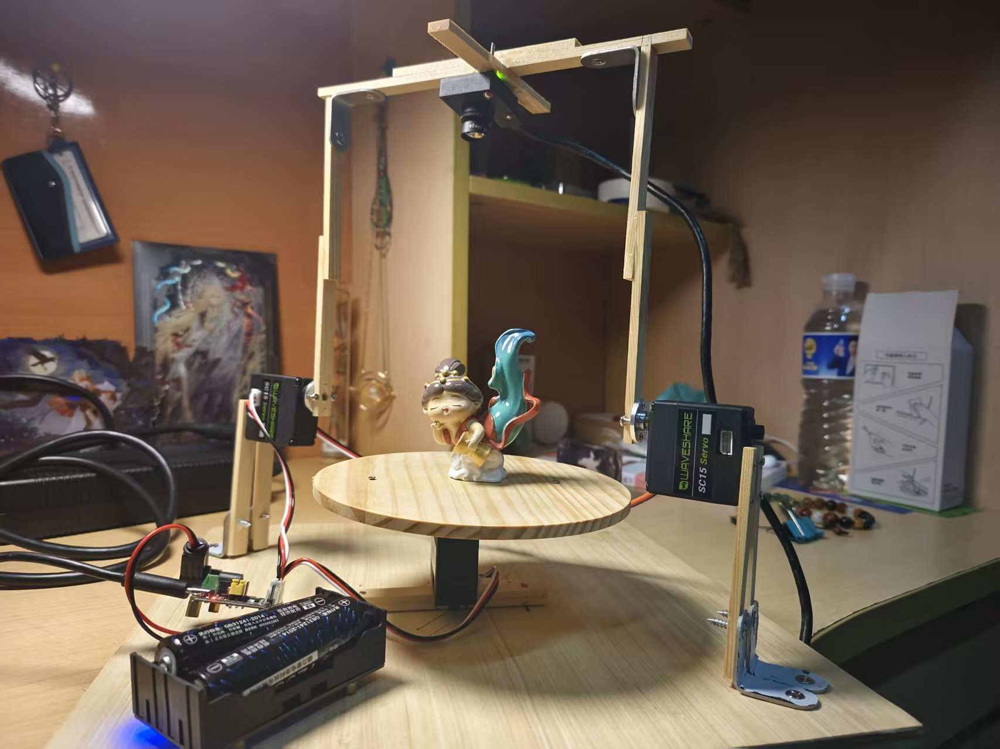

The workflow is as follow:
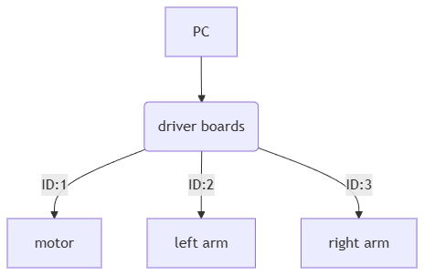

We input a timed and rated PWM wave to the servo of ID1 to use it as a motor, and control its rotation Angle through speed and time.

In addition, we use the functions of the ID2,3 servos themselves to control the rotation Angle of the rocker arm.

Combining various purchased wooden consumables such as screws, a hardware platform was built


#### 2.1.2 Key Hardware Components

##### Hardware assembly
We used 30 * 30 * 1(cm) square wooden boards as the base, a circular wooden board with a diameter of 15(cm) and a thickness of 0.6(cm) as the rotating platform, 10* 1 *0.5(cm) wooden strips to build the mechanical arm, and various types of self-tapping screws and L-shaped fasteners to construct the hardware platform.

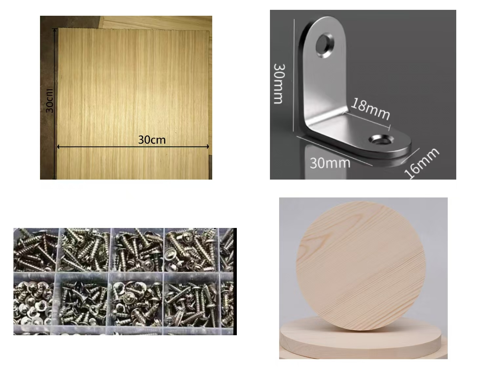

Since using self-tapping screws directly would cause the wood to crack and get damaged, we first drill holes at the designed positions with an electric drill and then fix them.

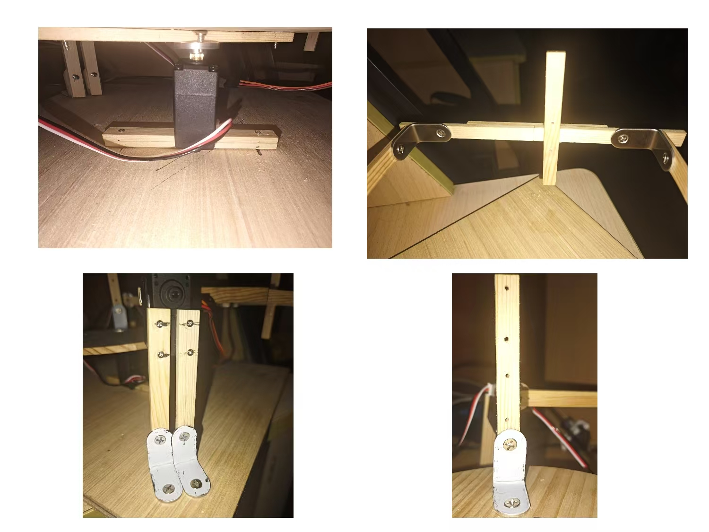

##### Motion Control Module
- Drive unit: [SC15 servo](https://www.waveshare.net/wiki/SC15_Servo#.E5.BC.80.E6.BA.90.E9.A1.B9.E7.9B.AE)
    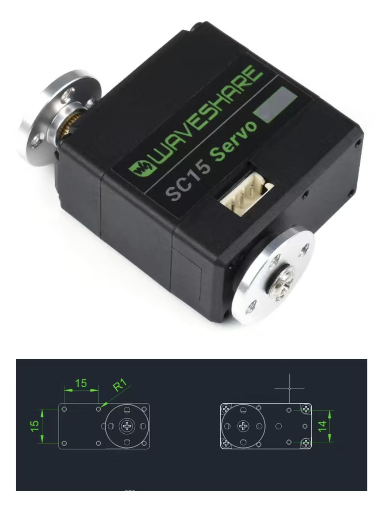
- Control board: [Bus Servo Adapter (A)](https://www.waveshare.net/wiki/Bus_Servo_Adapter_(A))
    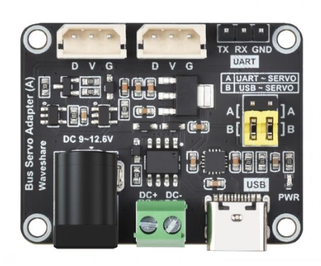
#### 2.1.3 Hardware Software Interface
Our hrdware control program is secondary eveloped based on the scservo_sdk , this driver package provides some basic command methods for interacting with hardware. It is a driver package specifically developed for hardware under the sc protocol.And `pyserial ==3.5` is needed.

The student responsible for building the hardware platform provided three operation interfaces and sample programs `hardware_example.py` to the student in charge of software modeling based on this package.

- rotatePlat
    This function is used to control the rotating platform to rotate at a certain speed for a certain period of time.**In fact, such an implementation is a trade-off because the servo of this model only supports precise rotation within 180 degrees when driven by a servo**.Therefore, we have to use its motor mode. After controlling the speed and time and conducting some related data tests, we provide such an interface.
    ```python
    def rotatePlat(duration=RUN_TIME,v=MOTOR_V):
    """Function to operate the plat.
    Attention!!!The unit of duratioin is second!!!
    Args:
        duration (int, optional): give the duratino time that you want the motor rotate for.
        Defaults to RUN_TIME.
        v (int, optional): give the speed of motor you want the motor to rotate at. Defaults to MOTOR_V.
    """
    ```

- rotateFrame
    Since the two servos are placed facing each other and rotate in opposite directions when setting up the hardware, the function implementation requires passing in the corresponding positions, then function  controlls the left and right rocker arms to add(left) or subtract(right) the corresponding position values based on the initial values.Based on this implementation idea, **we measured the initial attitude of the servo multiple times when building the hardware to enable the robotic arm to rotate at the maximum Angle.**
    
    To achieve synchronized operation of the two servos, we use the servo's writeReg —— write the position into the register, and then make the servo rotate synchronously through the broadcast signal.
    ```python
    def rotateFrame(angle=0):
    """Function to operate the robot arm that fix the camera
    Args:
        angle (int, optional):Position of the robot arm.A integer of [0,600] ,
                    where 0 denote the robot arm is parallel to the horizontal plane.
                    The larger the number, the higher the robot arm's position. 
                    400 indicates a vertical position to the ground
                    Defaults to 0.
    """
    ```
- takePhoto
    A function used to control the camera to take pictures and store the photos at the designated location
    ```python
    def take_photo(camera, save_dir, plat_angle, frame_angle):
    """
    This function is to take photo with the passed-in camera
    and save photo in save_dir named with plat angle and frame angle
    """
    ```

The above are all the software and hardware interfaces.**When using this interface to control hardware, the following workflow must be followed:**

You can refer to `hardware_example.py`.

### 2.2. Classic Workflow with COLMAP
#### 2.2.1 COLMAP Reconstruction Principles and Steps
1. SIFT Algorithm (Scale-Invariant Feature Transform)
   - Function: Detect stable feature points from a single image, generate descriptors, provide a basis for feature matching between different images, and serve as the foundation for 3D reconstruction.
   - Principle:
     - Construct a multi-scale Gaussian pyramid to simulate different viewing distances;
     - Find stable feature points in the pyramid;
     - Assign directions to feature points to make them unaffected by image rotation;
     - Extract texture information around feature points to generate descriptors.

2. RANSAC Algorithm (Random Sample Consensus)
   - Function: Screen out reliable matching points and eliminate incorrect matches to avoid affecting subsequent reconstruction accuracy.
   - Principle:
     - Randomly select a small number of sample points and fit an initial geometric model;
     - Calculate the error of all data relative to the model and filter out reliable points that meet the requirements;
     - Repeat sampling and fitting, and select the model with the most reliable points as the optimal result.

3. SfM Algorithm (Structure from Motion)
   - Function: Calculate the camera's position/orientation and 3D point coordinates simultaneously without prior knowledge of camera parameters or scene information, completing the core transformation from 2D images to sparse 3D reconstruction.
   - Principle:
     - Select image pairs with the most matching points, calculate the relative camera position, and obtain initial 3D points;
     - Add new images one by one, determine the new camera position based on existing 3D points, and generate new 3D points;
     - Optimize camera positions and 3D point coordinates to reduce errors;
     - Eliminate invalid data with excessive errors.

4. Undistortion Algorithm
   - Function: Correct imaging distortion of the camera lens and generate undistorted images, providing clear input for dense reconstruction.
   - Principle:
     - Use distortion coefficients obtained from sparse reconstruction to reversely calculate undistorted pixel positions;
     - Fill pixel values through interpolation to generate undistorted images, and organize camera parameters simultaneously.

5. Dense Reconstruction Algorithm (PatchMatch Stereo, PMS)
   - Function: Estimate depth for each pixel in undistorted images, generate dense depth maps, and fill in the detail gaps of sparse point clouds.
   - Principle:
     - Determine the depth search range for pixels based on sparse point clouds;
     - Randomly assign initial depth values to each pixel;
     - Iteratively optimize to obtain the optimal depth by referring to the depth of adjacent pixels and other perspectives;
     - Eliminate inconsistent incorrect depths and filter noise.

6. Stereo Fusion Algorithm
   - Function: Merge depth maps from all perspectives to generate a complete and reliable dense 3D point cloud.
   - Principle:
     - Convert pixels of each depth map into 3D points using camera parameters;
     - Retain 3D points consistent across multiple perspectives, and eliminate abnormal and duplicate points;
     - Merge all reliable 3D points to form a global dense point cloud.

7. Surface Reconstruction Algorithm (Poisson Reconstruction)
   - Function: Generate a smooth 3D surface mesh from a dense point cloud, forming a directly usable 3D model.
   - Principle:
     - Calculate the normal vectors of the dense point cloud and unify their directions;
     - Use mathematical methods to fit the surface of the point cloud;
     - Extract the fitted surface to generate a 3D mesh model.

#### 2.2.2 Core Program
##### 2.2.2.1 Shooting Program
- Usage of Core Function Interfaces
  Two hardware control function interfaces are mainly used to achieve angle adjustment:
  1. rotateFrame(angle): Drives the 2nd and 3rd servos to rotate synchronously in opposite directions, precisely controlling the rotation of the camera frame;
  2. rotatePlat(duration): Drives the 1st motor to achieve the rotation of the shooting platform by controlling the rotation duration.

- Shooting Logic Flow
  1. Initialization: Connect and configure the Basler camera, and start image acquisition; initialize serial communication, reset the frame to 0° and stabilize for 1 second.
  2. Shooting Cycle (Frame First, Then Platform):
     - The outer loop iterates over `PLAT_COUNT` platform positions (evenly divided over 360°), and the inner loop iterates over `FRAME_COUNT` frame positions (evenly divided over 90°);
     - Fix the platform position, sequentially rotate the frame to each preset angle via rotateFrame(), and capture one image per rotation;
     - After completing the shooting of all frame angles for one platform position, rotate the platform to the next position via rotatePlat(), reset the frame, and enter the next round of shooting.
```python
for i in range(PLAT_COUNT):
    # Calculate current platform angle (evenly divided over 360°)
    plat_angle = i * 360 / PLAT_COUNT
    for j in range (FRAME_COUNT):
        # Calculate current and next frame angles (evenly divided over 90°)
        frame_angle = j * 90 / FRAME_COUNT
        next_frame_angle = (j + 1) * 90 / FRAME_COUNT
        
        # Capture image at current (platform-frame) angle combination
        time.sleep(0.5)  # Stabilization delay
        take_photo(camera, save_dir, plat_angle, frame_angle)  # Save image with angle labels
        time.sleep(0.5)
        
        # Rotate frame to next position for next shot (×5 for hardware protocol adaptation)
        rotateFrame(int(next_frame_angle * 5))
        time.sleep(0.5)
    
    # After all frame angles are shot for current platform position:
    time.sleep(0.5)
    rotatePlat(1 / PLAT_COUNT)  # Rotate platform to next position (duration = 1/7s)
    rotateFrame(0)  # Reset frame to initial position
    time.sleep(1.5)  # Longer stabilization delay for platform
```
  3. Supplementary Shooting (optional): After completing all combined shootings, capture an additional image with the "frame at 90°".

- Reason for Choosing the Shooting Logic
  The core reason for choosing the logic of "rotating only the frame (rotateFrame) for a single photo and rotating the platform (rotatePlat) after completing the shooting of a set of frame angles" is the optimization of shooting quality and subsequent reconstruction results caused by differences in equipment precision:
  - Precision Difference: rotateFrame() is controlled by servos with accurate angle mapping, enabling it to stably stay at the preset target position with high repeatability and accuracy of frame angles; while rotatePlat() controls the rotation angle through motor duration, which cannot accurately stay at the preset position due to the influence of motor speed stability, mechanical transmission errors, etc., resulting in large angle deviations;


##### 2.2.2.2 Reconstruction Script

This script implements automated 3D reconstruction based on COLMAP's command-line mode, connecting to the multi-angle images output by the shooting program and completing end-to-end processing following the standard reconstruction workflow:
1. Automatically configures the image input path, database path, and result output path, while verifying the validity of the COLMAP executable file;
2. Initializes the workspace and cleans up historical files to avoid conflicts;
3. Sequentially executes 7 core steps: feature extraction, feature matching, sparse reconstruction, image undistortion, dense reconstruction (PatchMatch Stereo), stereo fusion, and surface meshing;
4. Finally outputs the sparse point cloud, dense point cloud (`fused.ply`), and surface mesh model (`meshed-poisson.ply`), and prompts the result storage paths.

The script requires no manual intervention throughout the process, strictly follows COLMAP's standard reconstruction workflow, is compatible with the images captured earlier, and can directly realize the automated conversion from images to 3D models.
### 2.3. Works on VGGT

#### 2.3.1 Architecture & Shooting Patterns

**Architecture**
VGGT (Visual Geometry Grounded Transformer) is a feed-forward neural network that directly infers all key 3D attributes of a scene, including camera parameters, point maps, depth maps, and 3D point tracks, from one, a few, or hundreds of its views, which is CVPR25's best paper. The architecture is as follows:

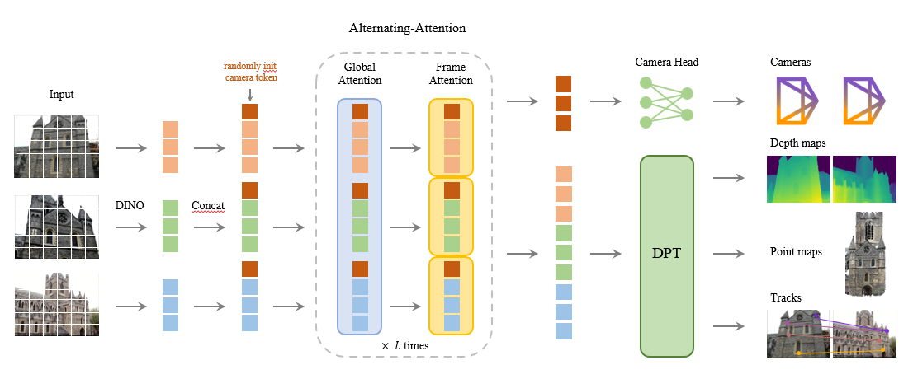

To begin with, the input image would be cut to small pieces by DINO and modified by the camera token. After that, the images would experience the **Alternating Attention** mechanism, with many global attention layers and frame attention layers alternating for many times. This process ensures that the transformer can learn both the global details and the single-frame details of the scene. Finally the output of the transformer would be used in different tasks. What's more, the architecture does not employ any cross-attention layers, only self-attention ones.

**Shooting Patterns**
When working with VGGT, the shooting pattern is as follows:

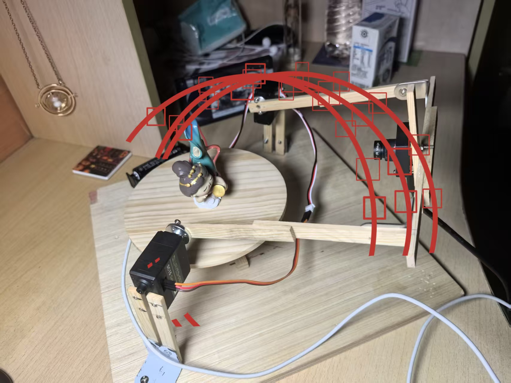

As for why we choose this pattern but not shooting images with a circle track in different heights, we will discuss in the next section.

#### 2.3.2 Use of VGGT

The key functions are shown below:
```python
dtype = torch.bfloat16 if torch.cuda.get_device_capability()[0] >= 8 else torch.float16

model = VGGT.from_pretrained("facebook/VGGT-1B").to(device)
...
    with torch.no_grad():
        with torch.cuda.amp.autocast(dtype=dtype):
            predictions = model(images)
...
    wp = predictions["world_points"].detach().float()
    wp_conf = predictions["world_points_conf"].detach().float()
    imgs = batch_images.detach().float().clamp(0, 1)
    
    all_wp.append(wp)
    all_wp_conf.append(wp_conf)
    all_imgs.append(imgs)
```

The model `VGGT-1B` would take up to 6.0 GB GPU memory, and my PC has 16 GB GPU memory, so in this project we can process up to 25 images at a time, which is already quite enough.

## 3. Analysis and Discussion

### 3.1 Optimizing COLMAP Reconstruction by Adjusting Shooting Modes
I forgot to save the images of the poorly generated sparse point cloud, so I cannot provide comparison charts here. The original (unoptimized) method involves first rotating the bottom platform and then rotating the frame to take photos — this leads to obvious platform position deviation under the same frame angle, large jumps in photo perspectives, and increased difficulty in feature point matching between images. Consequently, the camera positions in the generated sparse point cloud are very scattered and irregular, and the outline and number of valid points of the point cloud images are far inferior to those from the optimized method. In contrast, the optimized approach fixes the platform position first and completes multi-angle shooting through precise frame rotation, which ensures continuous perspectives and accurate angles of images under the same platform position. This further enhances the correlation of feature points between photos, provides more reliable image data for subsequent 3D reconstruction, and ultimately improves the precision and integrity of the reconstruction results.

### 3.2 VGGT: Some Discussions

#### 3.2.1 The pattern of the shooting

The key mechanism of the VGGT is the **Alternating Attention**, in which not only the object, the environment would also be considered in the attention mechanism. Thus, if we chose to shoot images with a circle track, though we can get the different aspects of the object, the relation between the object and the environment would be damaged. As a result, the 3D reconstruction point cloud would have many dark and bold cracks on the surface. To solve this problem, we chose to shoot images in a variety of heights and a small angle change.

#### 3.2.2 The Factors Influencing the Quality of 3D Reconstruction

##### 3.2.2.1 Dose inference by batches help? No!

The first natural thought that we can devide the frames into batches to avoid the memory limitation. The experiment result is as follows:

|batches|1|2|5|2_ICP|
|:---:|:---:|:---:|:---:|:---:|
|output .ply|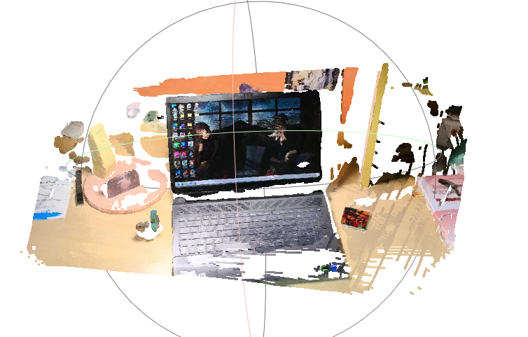|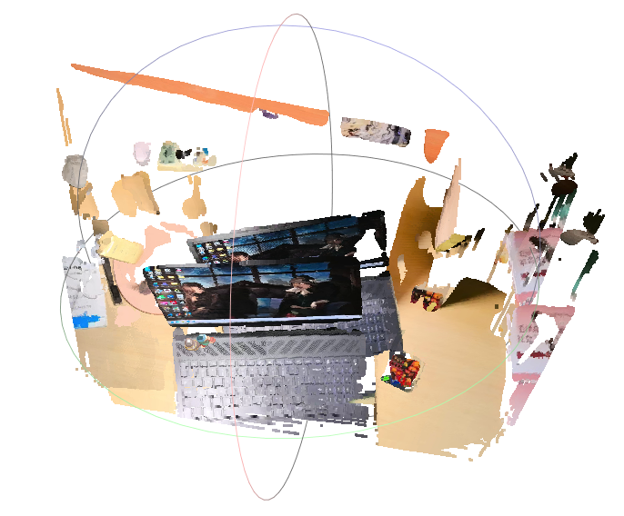|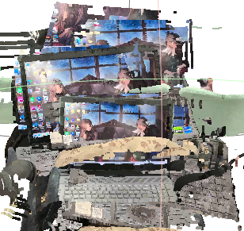|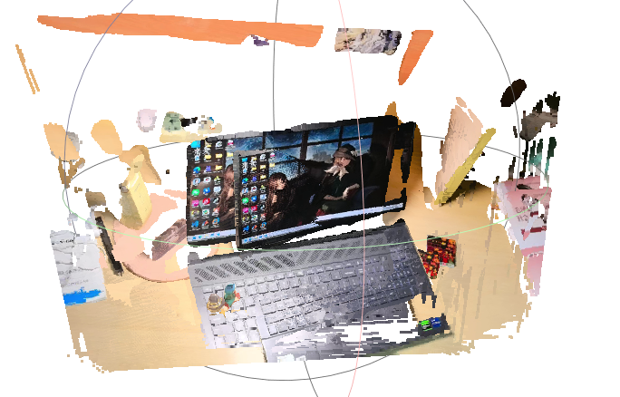|

As can be seen from the table, the number of ghosting artifacts in the results is exactly equal to the number of batches used for inference. This is because the world coordinates in the inference results of VGGT are always estimated based on the current set of images. When directly stitching point clouds from different batches, ghosting artifacts are unavoidable due to the inconsistency of world coordinates.

##### 3.2.2.2 Does ICP algorithm help? Rarely...

Since the issue of inconsistent world coordinates exists, another question is whether different world coordinates can be unified into a single environment. Through Chat-GPT, we learned about the ICP algorithm (the principle will not be repeated here). However, as shown in the result corresponding to "2_ICP" in the figure above, the ICP algorithm can only converge different ghosting artifacts onto a single plane, but is unable to solve the problem of overall offset of the point cloud. In subsequent communications with Group 8 (who also researched the ghosting issue and designed their own method, though it is not a general solution), we confirmed that there is currently no effective solution to this problem.

##### 3.2.2.3 Does more attentions help? Rarely...

Another natural idea is: if batch-wise processing doesn't work, can we obtain a more detailed point cloud by having the model attend to the same set of frames multiple times? In the experiment, we selected the same group of photos (Saure's desk) and had the model perform inference repeatedly (the classic VGGT-1B model contains 24 sets of repeated AA attention layers). However, as shown in the table below, the model's output is very stable, and apart from increasing the volume of the point cloud, multiple attentions barely lead to any observable increase in details visible to the naked eye.

|repeat|1|2|3|4|
|:---:|:---:|:---:|:---:|:---:|
|output .ply||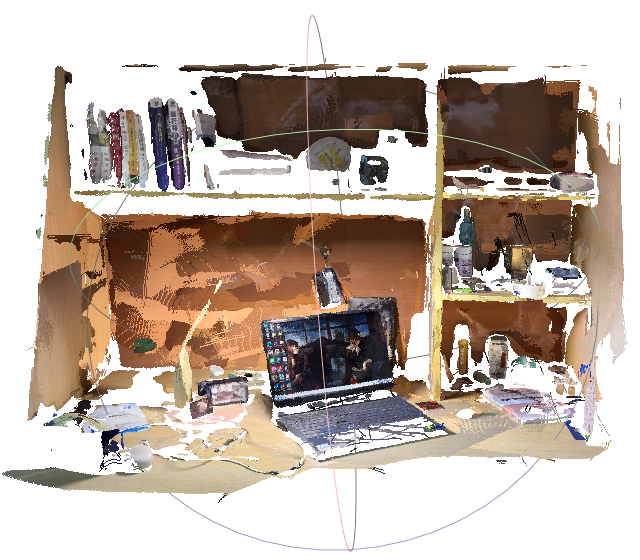||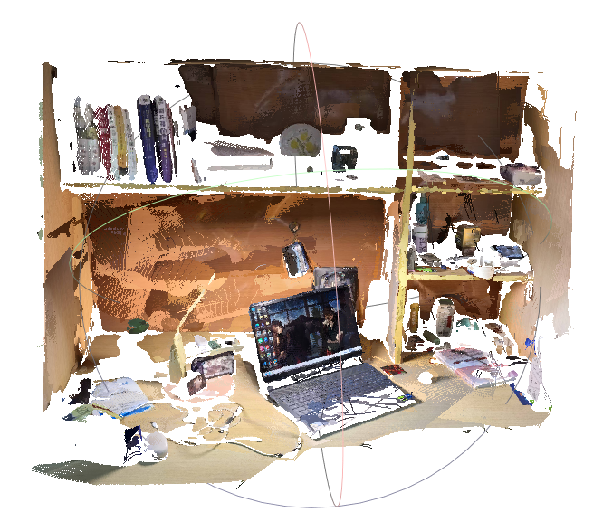|

## 4. Conclusion

### 4.1 colmap reconstruction results

The images of the generated sparse point cloud and dense point cloud are as follows:
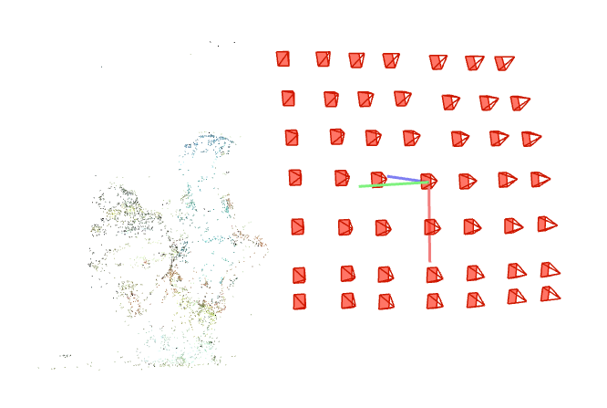
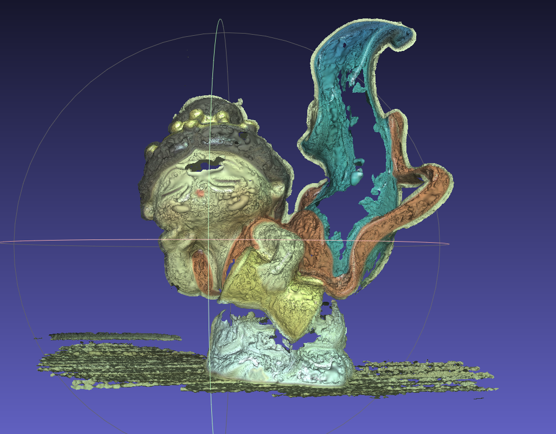

### 4.2 VGGT reconstruction results


## 5. References & Acknowledgements

### 5.2 the reference website of COLMAP script 
Reference Websites:
1. [COLMAP Installation and 3D Point Cloud Reconstruction Full Process Explanation: From Installation Configuration to Model Viewing](https://blog.csdn.net/qq_22841387/article/details/144797649)
2. [COLMAP Quick Tutorial (Command-Line Mode)](https://www.cnblogs.com/phillee/p/14335034.html)
3. [Traditional 3D Reconstruction Practice with Colmap (GUI | Command-Line)](https://zhuanlan.zhihu.com/p/362701018)
4. [COLMAP | Command-Line Operations](https://zhuanlan.zhihu.com/p/1913700966622004956)
5. [doubao](https://www.doubao.com/thread/wa1c990144e059204)