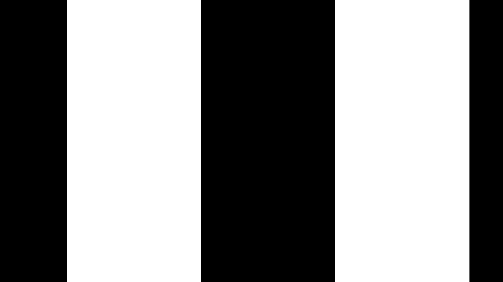
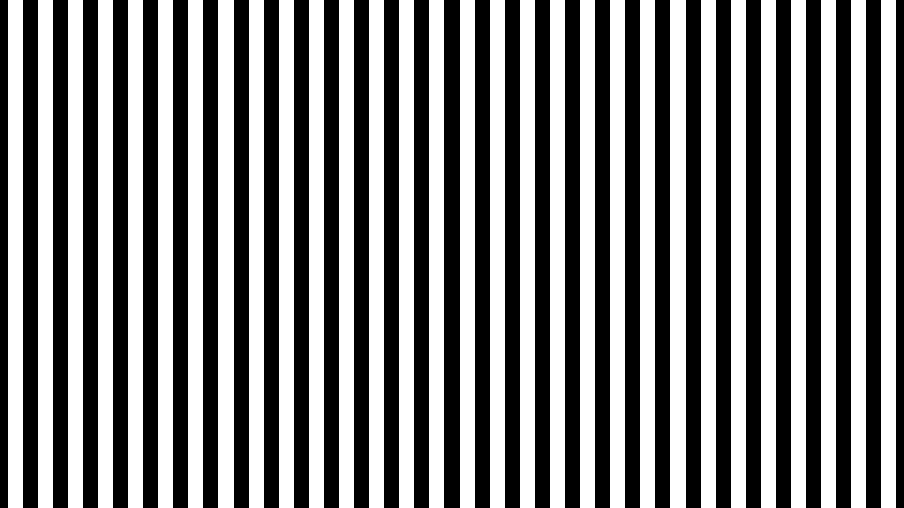
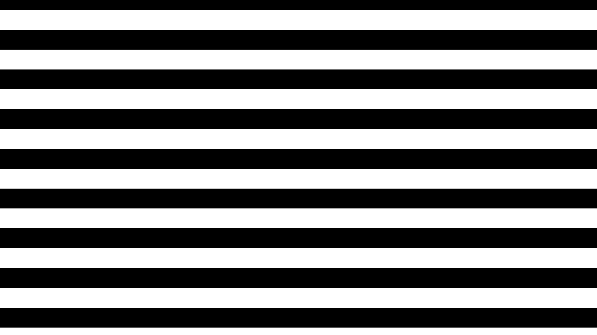
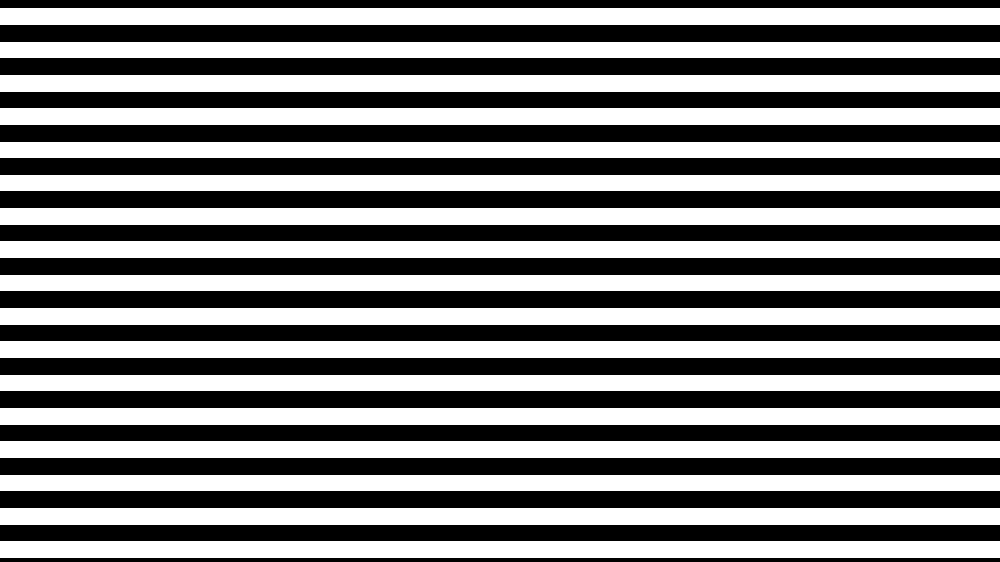
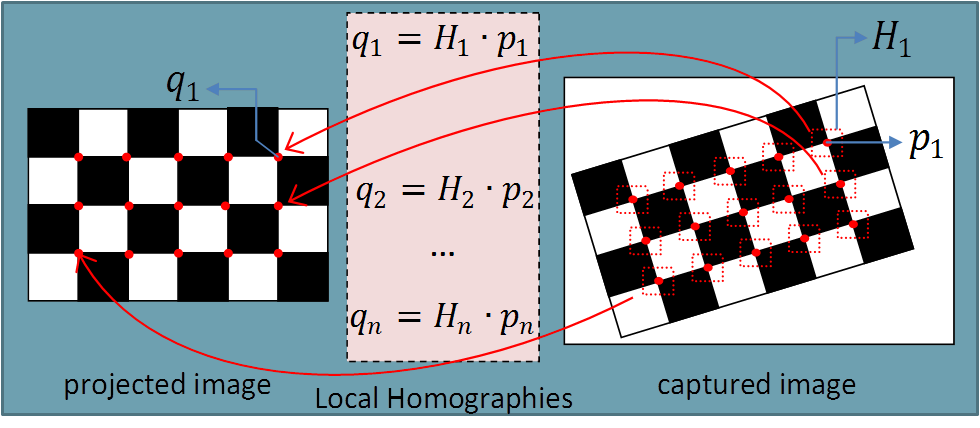

# Lab 5 | Projector-Camera-Based Stereo Vision

## 1. Introduction

### 1.1. Theory

In privious lab 4, we already know that we can achieve the stereo vision with two cameras. However, the projector can be seen as a reversed camera, in which, the image projected on the wall is the scene while the image itself is the "photo" shot by the projector. Thus, we can use just one camera and a projector to achieve the stereo vision. To realize this, we need to:
1. Calibrate the camera-projector system
2. Project a pattern / a few patterns
3. Establish the correspondences between camera pixels and projector pixels
4. Triangulate (Depth map & 3D point cloud)

### 1.2. Environment and Hardware

The resolution of the projector: **1920x1080**.
<Saure>

## 2. Projector-Camera-Based Stereo Vision

### 2.1. Generate Gray Code

Because $1920 \lt 2^{11}$, $1080 \lt 2^{11}$, we need 11 vertical gray codes and 11 horizontal gray codes. Gray codes can assure that for all the pixels on the chessboard around the image set, there are no two pixels with the same gray code (Namely, no two same light-dark patterns). The Formula is:

$\mathbf{G}(i) = \mathbf{B}(i)$ for the highest bit
$\mathbf{G}(i) = \mathbf{B}(i) \oplus \mathbf{B}(i+1)$ otherwise

The key function/code block is:
```python
<Saure>
```

And here we display some of the generated gray codes.

||||
|:---:|:---:|:---:|
||||

### 2.2. Calibrate the Camera-Projector System

We place the chessboard on the wall with different positions and angles, and then project the gray codes on the chessboard and take pictures.After the aquisition of the data, we got <Saure> sets of images and each set contains <Saure> images.

We use the software from [http://mesh.brown.edu/calibration/](http://mesh.brown.edu/calibration/) to calibrate the system: 


<Saure: altanating> Given that the software provided in the slides is too old to be used, we found a newer repository for camera-projector calibration in Github: [https://github.com/kamino410/procam-calibration](https://github.com/kamino410/procam-calibration)


This software/script can calibrate the system automatically and print out the result:


### 2.3. Establish the correspondences between camera pixels and projector pixels

During the stereo calibration, we firstly identified the positions of the inner corners of the chessboard. For each corner, we can get its sub-pixel level coordinates $(u_cam, v_cam)$ on the camera image. Via the gray code, we can also get the corresponding positions $(u_proj, v_proj)$ on the projector image. Thus, just like stereo vision with two cameras, we can calculate the rotation matrix $R$ and the translation vector $T$. This process is achieved automatically by the software.



> This graph is from D. Moreno and G. Taubin, "Simple, Accurate, and Robust Projector-Camera Calibration," School of Engineering, Brown University, Providence, RI, USA, 2018.

### 2.4. Triangulate (Depth map & 3D point cloud)

We set up a scene and project the same gray codes on it to get the image set. Using the gray codes, we can get the coordinates $(u_proj, v_proj)$ for each pixel on the image. Namely, we got the image "shot" by the projector. After that, we apply the distortion coefficient of the projector and the camera to correct the "two" images. And the following process is same as stereo vision with two cameras.

Key function/code block is:
<Saure>

## 3. Result and Data Processing

<Saure>

## 4. Analysis and Discussion

<Saure>

## 5. Conclusion

## 6. References and Use of AI

During the lab, we use AI to understand the theories(Doubao), reference the code(Doubao), verificate the correctness of the images(Doubao) and generate some repetitive code(Copilot), as well as to translate the part of the report into Chinese(Doubao).