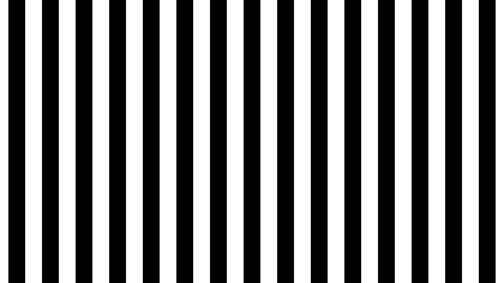
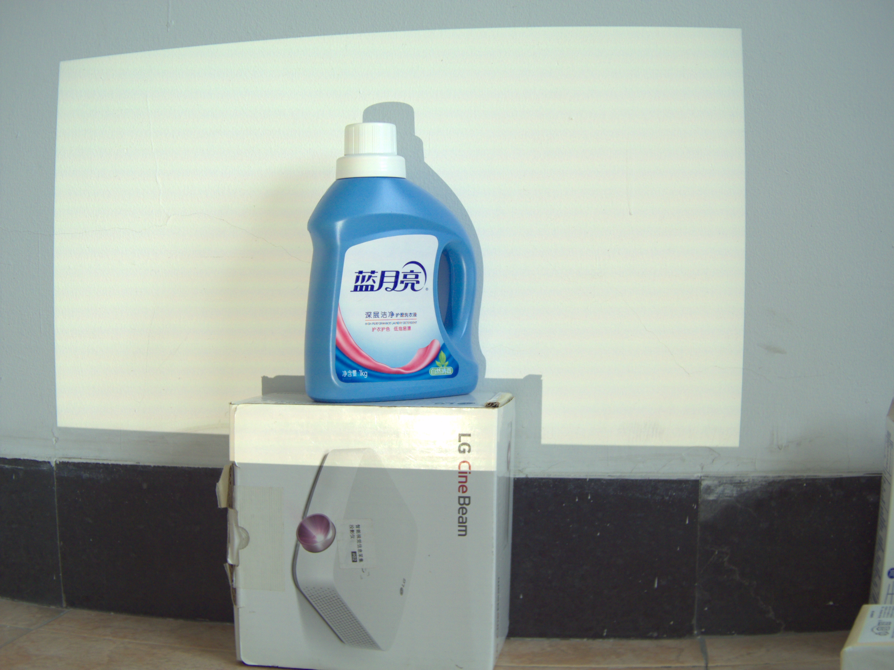
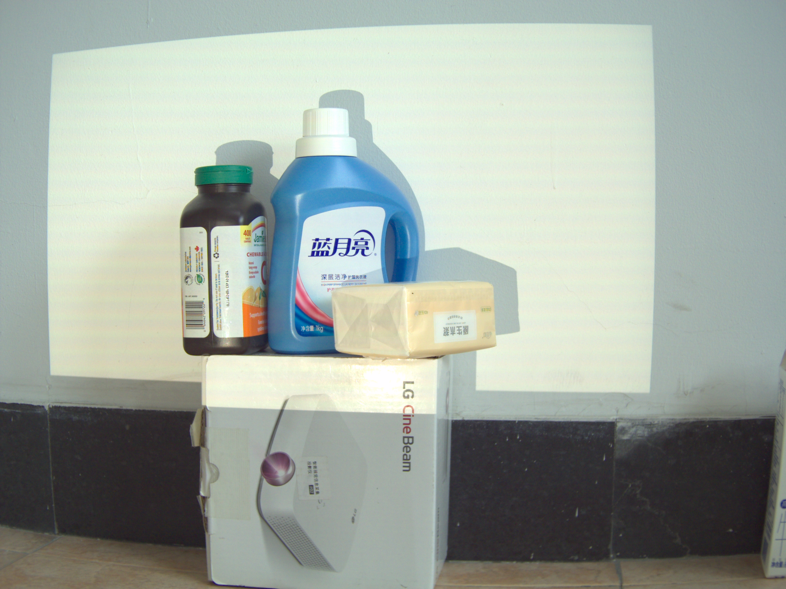
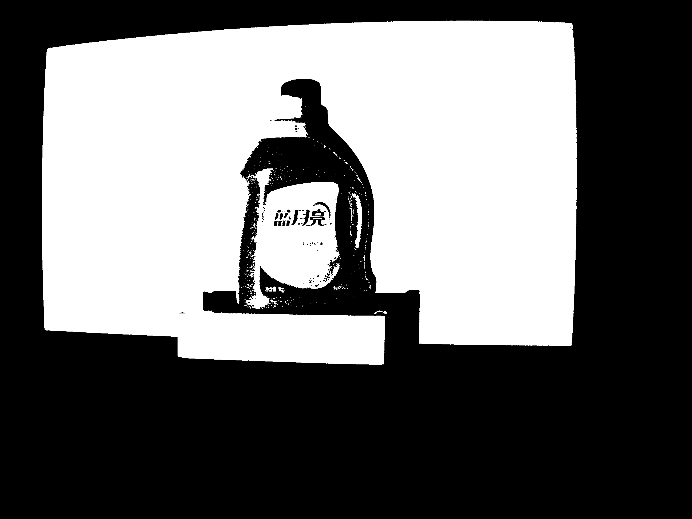
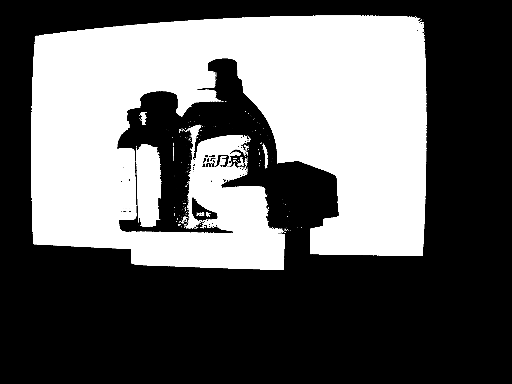
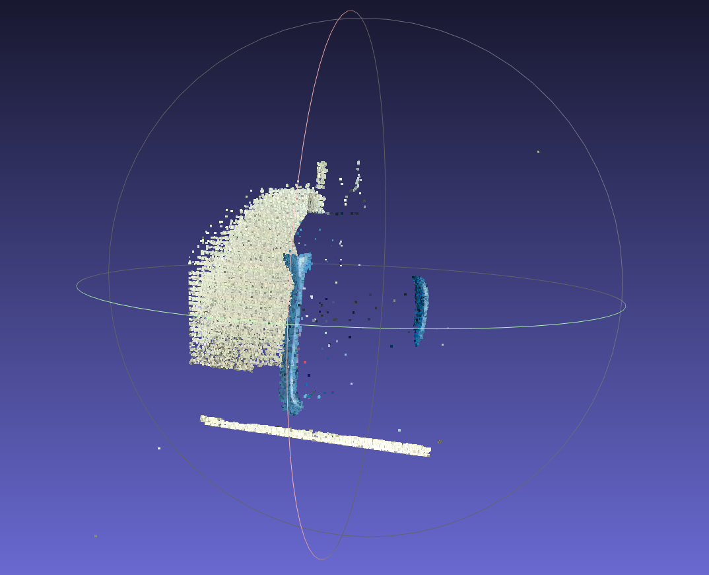
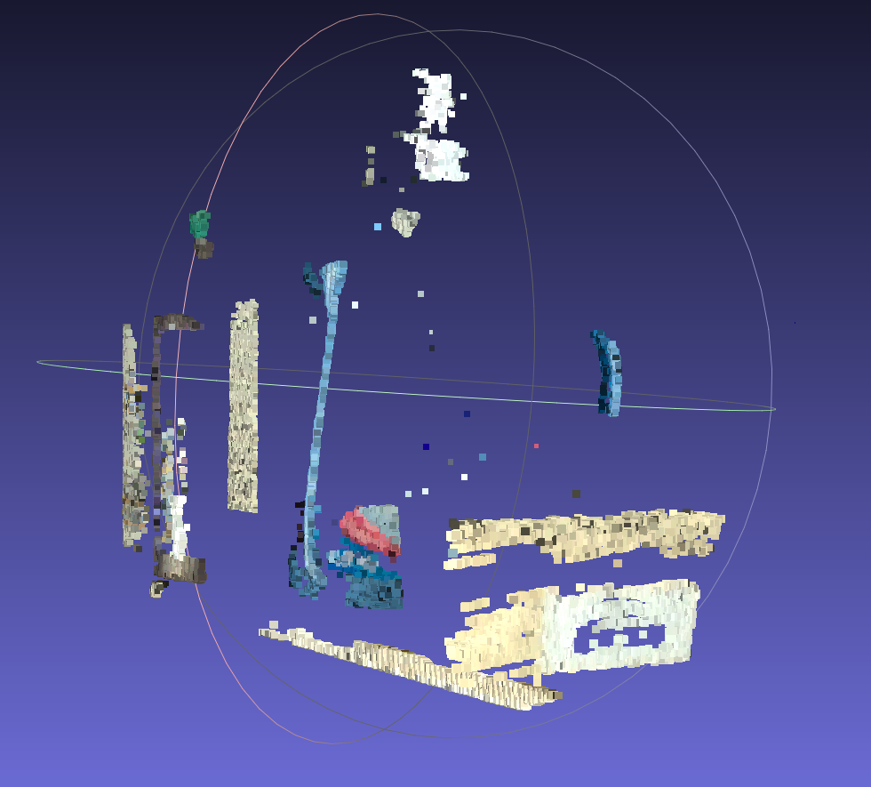
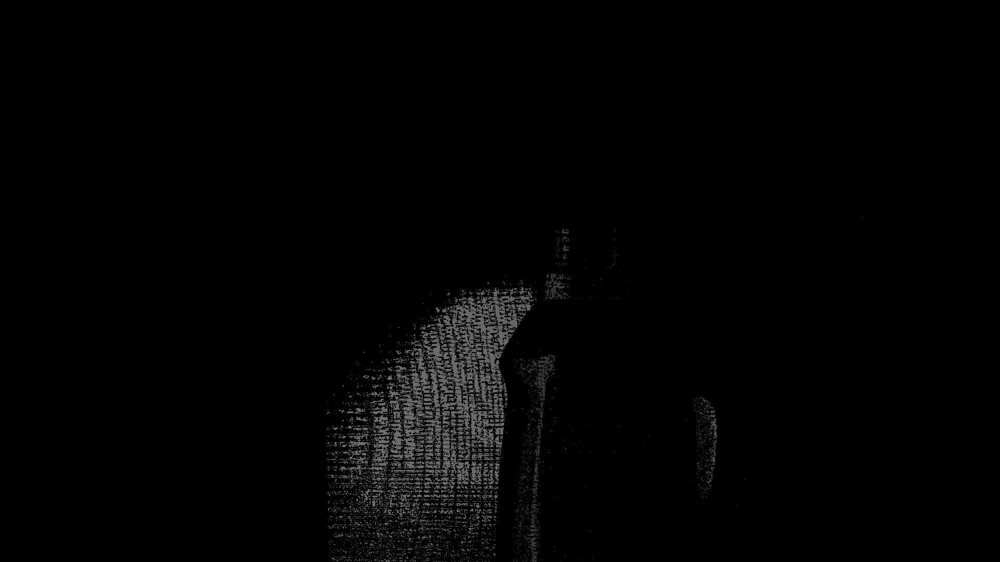
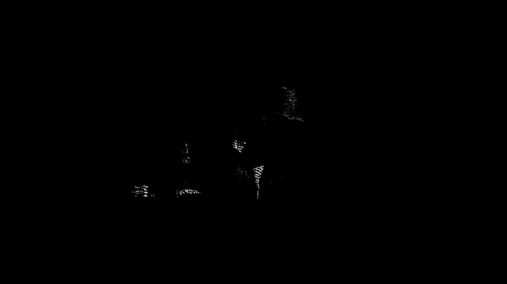

# Lab 5 | Projector-Camera-Based Stereo Vision

## 1. Introduction

### 1.1. Theory

In privious lab 4, we already know that we can achieve the stereo vision with two cameras. However, the projector can be seen as a reversed camera, in which, the image projected on the wall is the scene while the image itself is the "photo" shot by the projector. Thus, we can use just one camera and a projector to achieve the stereo vision. To realize this, we need to:
1. Calibrate the camera-projector system
2. Project a pattern / a few patterns
3. Establish the correspondences between camera pixels and projector pixels
4. Triangulate (Depth map & 3D point cloud)

### 1.2. Environment and Hardware

The resolution of the projector: **1920x1080**.

## 2. Projector-Camera-Based Stereo Vision

### 2.1. Generate Gray Code

Because $1920 \lt 2^{11}$, $1080 \lt 2^{11}$, we need 11 vertical gray codes and 11 horizontal gray codes. Gray codes can assure that for all the pixels on the chessboard around the image set, there are no two pixels with the same gray code (Namely, no two same light-dark patterns). The Formula is:

$\mathbf{G}(i) = \mathbf{B}(i)$ for the highest bit
$\mathbf{G}(i) = \mathbf{B}(i) \oplus \mathbf{B}(i+1)$ otherwise

And here we display some of the generated gray codes.

||||
|:---:|:---:|:---:|
||||

### 2.2. Calibrate the Camera-Projector System

We place the chessboard on the wall with different positions and angles, and then project the gray codes on the chessboard and take pictures.After the aquisition of the data, we got 3 sets of images and each set contains 44 images.

We use the software from [http://mesh.brown.edu/calibration/](http://mesh.brown.edu/calibration/) to calibrate the system.This software/script can calibrate the system automatically and print out the result.

### 2.3. Establish the correspondences between camera pixels and projector pixels

During the stereo calibration, we firstly identified the positions of the inner corners of the chessboard. For each corner, we can get its sub-pixel level coordinates $(u_cam, v_cam)$ on the camera image. Via the gray code, we can also get the corresponding positions $(u_proj, v_proj)$ on the projector image. Thus, just like stereo vision with two cameras, we can calculate the rotation matrix $R$ and the translation vector $T$. This process is achieved automatically by the software.


> This graph is from D. Moreno and G. Taubin, "Simple, Accurate, and Robust Projector-Camera Calibration," School of Engineering, Brown University, Providence, RI, USA, 2018.

### 2.4. Triangulate (Depth map & 3D point cloud)

We set up a scene and project the same gray codes on it to get the image set. Using the gray codes, we can get the coordinates $(u_proj, v_proj)$ for each pixel on the image. Namely, we got the image "shot" by the projector. After that, we apply the distortion coefficient of the projector and the camera to correct the "two" images. And the following process is same as stereo vision with two cameras.

Key function/code block is:

#### 1. Correlation between Input Parameters and System Calibration
The input parameters of the function, including `cam_matrix` (camera intrinsic matrix), `proj_matrix` (projector intrinsic matrix), `R` (rotation matrix), and `T` (translation vector), are prerequisites for triangulation. These parameters are derived from the "camera-projector system calibration" mentioned in the report:
- The calibration process establishes the correspondence of chessboard corners between the camera and the projector through gray code patterns (Section 2.1 of the report), and finally solves for their intrinsic parameters (distortion coefficients `self.cam_dist`/`self.proj_dist`) and extrinsic parameters (`R`, `T`), which describe the pose of the projector relative to the camera.

#### 2. Correspondence Point Extraction
In the code:
```python
ys, xs = np.where(self.mask == 1)  # Coordinates of valid pixels in the camera image (u_cam, v_cam)
proj_xs = self.x_map[ys, xs]       # Corresponding u-coordinate in the projector image (u_proj)
proj_ys = self.y_map[ys, xs]       # Corresponding v-coordinate in the projector image (v_proj)
```
- The core of this step is to obtain the "camera pixel-projector pixel" correspondence. By projecting gray code patterns, the corresponding projector pixel (`proj_xs, proj_ys`) for each pixel (`xs, ys`) in the camera image can be determined. `x_map` and `y_map` are mapping tables that store this correspondence (obtained by gray code decoding).
- `self.mask == 1` indicates that only the effectively observed regions in the scene are processed (e.g., excluding background noise).

#### 3. Distortion Correction
Distortion correction is performed using `cv2.undistortPoints` in the code:
```python
cam_pts_norm = cv2.undistortPoints(cam_pts, cam_matrix, self.cam_dist)  # Camera pixel correction
proj_pts_norm = cv2.undistortPoints(proj_pts, proj_matrix, self.proj_dist)  # Projector pixel correction
```
- Actual camera and projector lenses have distortions. It is necessary to convert pixel coordinates (`u, v`) into normalized image plane coordinates (`x, y`, in meters, with the principal point as the origin) using the distortion coefficients in the intrinsic parameters (`self.cam_dist`/`self.proj_dist`). This eliminates distortion effects and ensures the accuracy of subsequent triangulation.

#### 4. Projection Matrix Construction
The projection matrices for the camera and projector are constructed in the code:
```python
P1 = np.hstack((np.eye(3), np.zeros((3, 1))))  # Camera projection matrix
P2 = np.hstack((R, T))                         # Projector projection matrix
```
- In binocular stereo vision, the projection matrix describes the mapping relationship from 3D points to 2D pixels:
  - `P1`: Taking the camera as the reference coordinate system (origin), the projection matrix is `[I | 0]` (identity matrix + zero vector), representing the projection of 3D points in the camera coordinate system.
  - `P2`: The pose of the projector relative to the camera is described by `R` (rotation) and `T` (translation), so the projection matrix is `[R | T]`, representing the projection of 3D points in the projector coordinate system.

#### 5. Triangulation Calculation
The core function `cv2.triangulatePoints` implements 3D point solving:
```python
pts4d = cv2.triangulatePoints(P1, P2, cam_pts_norm.T, proj_pts_norm.T)  # Homogeneous 3D coordinates
pts3d[valid, :] = (pts4d[:3, valid] / w[valid]).T  # Conversion to inhomogeneous coordinates
```
- Principle: Based on the perspective projection constraint of "binocular stereo vision", a 3D point `X` in space must satisfy `x1 ∝ P1·X` and `x2 ∝ P2·X` for its projections (normalized coordinates) on the camera and projector. By solving the overdetermined system of equations (formed by combining the constraints), the homogeneous coordinates `pts4d = [X, Y, Z, w]^T` are obtained using Singular Value Decomposition (SVD). Then, the inhomogeneous 3D coordinates (in the camera coordinate system) are derived via `(X/w, Y/w, Z/w)`.

#### 6. Result Filtering and Point Cloud Saving
Invalid points (e.g., points with `w` close to 0 or negative depth) are filtered using `valid` and `finite_mask` in the code, and the point cloud is finally saved:
```python
valid_idx = np.where(valid & finite_mask)[0]  # Filter invalid points
pcd.points = o3d.utility.Vector3dVector(pts3d)  # Construct point cloud
o3d.io.write_point_cloud(output_ply, pcd)  # Save result
```
- The quality of the point cloud is improved through filtering, and a usable 3D point cloud is finally generated.

## 3. Result and Data Processing
- Calibration results:
```yml
%YAML:1.0
cam_K: !!opencv-matrix
   rows: 3
   cols: 3
   dt: d
   data: [ 3.6838333907732294e+003, 0., 1.2500944196559094e+003, 0.,
       3.6974474889257835e+003, 1.0122781917607587e+003, 0., 0., 1. ]
cam_kc: !!opencv-matrix
   rows: 1
   cols: 5
   dt: d
   data: [ -5.1558942293476151e-001, 7.9382621058611061e-002,
       1.9059474312756614e-004, 3.5905157827651230e-003, 0. ]
proj_K: !!opencv-matrix
   rows: 3
   cols: 3
   dt: d
   data: [ 2.8013622132143819e+003, 0., 5.3714564964254430e+002, 0.,
       2.7957271561105604e+003, 8.1512682665321393e+002, 0., 0., 1. ]
proj_kc: !!opencv-matrix
   rows: 1
   cols: 5
   dt: d
   data: [ 3.3709414619914682e-002, 3.9240756191495979e-001,
       1.5743724471346715e-004, 6.1563512624725311e-004, 0. ]
R: !!opencv-matrix
   rows: 3
   cols: 3
   dt: d
   data: [ 9.8097166816623960e-001, 1.9129352460664582e-002,
       -1.9320624764634459e-001, 3.8199208382748290e-003,
       9.9303996753376567e-001, 1.1771589138823595e-001,
       1.9411335466663360e-001, -1.1621398691626285e-001,
       9.7407100089525933e-001 ]
T: !!opencv-matrix
   rows: 3
   cols: 1
   dt: d
   data: [ 1.7194845987298550e+001, -1.2098438607071827e+001,
       -6.8266691762771616e+000 ]
cam_error: 1.7630641014309259e-001
proj_error: 2.0475616822158024e-001
stereo_error: 4.7143570184252465e-001
```
- Generated gray code images (nbit = 11): (Examples only, not all images listed)



- Object to be reconstructed


- Generated mask image:



- Generated point cloud image:


- Generated depth image:


## 4. Analysis and Discussion
It can be seen that our 3D point cloud can only recognize the partial outline of the object, which consequently results in the depth map only outputting a small number of outlines.
Our calibration results are excellent with small errors. However, our 3D reconstruction was not very successful. This may be because the surface of the reconstructed object we selected (a laundry detergent bottle) is too smooth and has a glossy label, making it impossible for the program to capture the gray code patterns on the surface. We only captured their outlines, which is an oversight on our part.
In addition, we found that our projector produces barely visible colorful fringes during projection. We tried several methods to mitigate these fringes, such as increasing the exposure level; however, this led to a new issue: during the acquisition of the lower bits of the gray code, the stripes—being excessively thin—became unrecognizable in the captured images. These colorful fringes may have affected the accuracy of our 3D reconstruction, resulting in unsatisfactory experimental results.

## 5. Conclusion

In conclusion, our project varified that the single-camera stereo vision with a projector can be used to generate 3D point clouds. However, the results were not so satisfactory due to the limitations of the projector and the precision of the algorithm. From the point cloud, we can see how the light conditions of both the environment and the projector influence the 3D reconstruction, and we have explored more algorithms with camera-projector system. Intrestingly, we found that the quality of 3D point clouds appeared in the papers of the same topic are averagely lower than two-camera stereo vision. We attribute this to the insufficient calibration of the projector parameters. At the very least, we still have a long way to go in camera-projector system stereo vision.

## 6. References and Use of AI

During the lab, we use AI to understand the theories(Doubao), reference the code(Doubao), verificate the correctness of the images(Doubao) and generate some repetitive code(Copilot), as well as to translate the part of the report into Chinese(Doubao).

[Find the code for the software to generate Gray codes from the software source code](https://www.doubao.com/thread/w2c27a64b04035f05)

[Understand the relevant principles and formulas of 3D reconstruction, as well as the generation of pseudocode](https://www.doubao.com/thread/w2e1252d4d3ce97c7)
